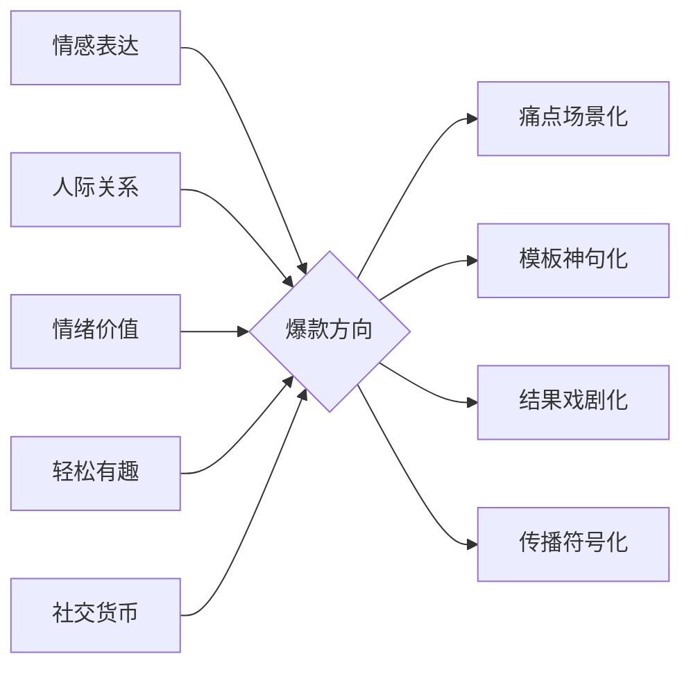

# Who

[toc]

## 名称/简介

> 固定模板的情感表达工具

名称：熊熊卡+感谢鼓励夸夸一键发
简介：
🐻 熊熊卡｜高情商表达小帮手
感谢/鼓励/夸夸/拒绝/道歉 词穷救星！
精选模板文，心意精准传达~
情侣和好｜闺蜜打气｜职场致谢｜轻松搞定！
💌30 秒选卡投递
❤️ 记得@我【你收到的熊熊卡】

-   「熊熊卡」是一款专为社交娱乐设计的暖心小程序，无论是感谢、道歉、鼓励，还是调皮拒绝，用可爱熊熊卡点亮每一次对话！🐻❤️
-   不敢当面说？让熊熊帮你递送！感谢、鼓励、夸夸、拒绝、道歉，专属暖心卡片，悄悄抵达 TA 心间。❤️ 快来投递你的心意！
    太棒了！这个信息完全颠覆了之前的理解。**熊熊卡不是实体卡/支付卡，而是一款轻量化的情感表达小程序！** 核心是 **投递/签收专属的电子心意卡**，主打 **感谢、鼓励、夸夸、拒绝、道歉** 五大主题。

这完全是一个**情感社交/工具类产品**，推广策略需要**180 度大转变**！之前的策略（省钱、优惠、支付）完全不适用。

**新核心思路：聚焦“情感表达”、“人际关系”、“情绪价值”、“轻松有趣”、“社交货币”、“难以开口”、“独特关系仪式感”**

## 垂类赛道精准定位

> **情感表达的“破冰者”与“仪式感引擎”**，化解表达尴尬，创造关系仪式感

合集沉淀：
创建“难以开口的话的 100 种说法”收藏夹，成为平台情感垂类必备素材库
🐻 熊熊卡｜高情商表达小帮手
感谢/鼓励/夸夸/拒绝/道歉 五大主题

### 核心用户痛点锚定

职场救命话术

-   **“难以开口”场景全覆盖**：聚焦道歉、感谢、暧昧期试探、家庭矛盾化解等语言表达高压力场景，提供标准化卡片模板（如“台阶卡”“和好卡”）降低心理门槛 7。
-   关系仪式感升级：针对 Z 世代对“仪式感”的强需求，设计生日盲盒卡、纪念日倒计时卡等数字化仪式工具，将抽象情感转化为可分享的视觉符号

### 差异化赛道切入

> 轻量化情感表达解决方案

-   **即时性**：3 秒生成可发送的卡片，替代小作文
-   **游戏化**
-   **社交货币化**

### 内容价值设计

| 内容层级   | 策略                                                      | 案例参考                       |
| ---------- | --------------------------------------------------------- | ------------------------------ |
| 基础工具层 | 提供 500+场景化卡片模板，支持自定义文案/图片              | 参照“亲宝宝”成长记录工具化设计 |
| 知识赋能层 | 短视频栏目《高情商话术实验室》：解析职场/恋爱场景表达技巧 | 借鉴“熊小婴”的医生 IP 科普     |
| UGC 生态层 | 用户创作卡片投稿计划，精选作品上架商城并分润              | 类似“布卡星”用户造景大赛       |
| 仪式场景层 | 限定节日卡片（如“清明忘崽符”“520 防拉黑护身符”）          | 参照《泡姆泡姆》表情包玩法     |

## 内容调优宝典 📚

-   选题
-   标题优化：明确受众的对象，或 疑问句结尾，增加互动率
-   视觉呈现：重点突出、剪辑流畅、富有创意、画面清晰
-   干货分享：向粉丝提供有价值的内容，使用技巧、独家见解
-   侧重点：

    -   视频博主：关注时长和画面比例是否合适，开头吸引力强，内容紧凑
    -   图文博主：图片构图，笔记的文字排版，通过分点和分段的方式，提升读者的阅读体验，让内容更加详略得当

-   封面优化
    -   竖版封面尺寸 3:4，横版封面尺寸 4:3
    -   封面文案：凝练清晰，总体不超过 10 个 字，单行不超过 5 个字（视觉焦点）

## 好的文案怎么写？

① 有用性。文案与图片相关、反映真实体验，详实有用，让用户看完后有收获；可尝试使用有趣、生活化，或是带有个人特色的文风更加分~
② 可读性。文案呈现样式详略得当、段落分明、重点清晰，整体有较强的可读性。
💡 通过适当分段、使用 emoji 等方式来「美化」文案，提升可读性；
💡 在每段的第一句突出内容重点与核心，能更清晰的向用户传达整段的内容信息；
💡 文案与图片顺序相关联，能给用户更好的阅读体验

## 粉丝维护心法

-   明确账号定位，了解粉丝需求
-   及时回复粉丝
-   定时更新，呼吁关注

## 小红书爆款视频公式

-   选题策划：受众需求+热点话题+个人特色=爆款选题，**垂类赛道**
-   完美内容：开头吸睛+中间充实+结尾互动=完美内容

    -   突出重点+调动情绪（感染力的词汇）+结合场景=标题封面
    -   发布时间：
        -   8:00 ~ 9:00：小黄金时间段，大多数人可能在吃早饭挤地铁，碎片时间充足
        -   12:00 ~ 14:00：中黄金时间段，午休时间
        -   15:00 ~ 16:00：小黄金时间段，临近下班
        -   18:00 ~ 20:00：中黄金时间段，下班时间段
        -   20:00 ~ 21:30：大黄金时间段，闲暇状态
        -   22:00 ~ 24:00：个别赛道可发，情绪主导时间，适合推送情感内容

-   吸粉内容
    -   寻找大众领域的小众内容
    -   挖掘小众领域的内容
    -   找一个喜欢的创作者作为参考对象

## 快手

-

## 06-17 以下是针对“熊熊卡”（情感心意卡小程序）的小红书内容策略：

### 🎯 核心目标

1.  **让用户知道“熊熊卡”是什么：** 清晰传达它是一个**方便、可爱、有仪式感的情感表达工具**。
2.  **激发用户的使用欲望：** 让用户觉得 **“这正是我需要的！”、“这能解决我表达情感的难题/让关系更美好/更好玩！”**。
3.  **鼓励用户去搜索和使用小程序。**

4.  **视觉第一！突出“可爱”与“情感”：** 所有封面图、内文图、视频必须**高清、色彩明亮、突出熊熊的可爱形象和卡片的情感氛围**。多用温暖、治愈的色调。
5.  **关键词布局 (更新)：**
    -   **核心词：** 熊熊卡、电子心意卡、情感表达、感谢卡、鼓励卡、夸夸卡、道歉卡、拒绝卡、社交神器、仪式感、可爱小程序、暖心工具、人际关系、高情商沟通
    -   **场景词：** 情侣、闺蜜、朋友、家人、父母、职场、同事、表白、道歉、和好、鼓励、夸夸、拒绝、节日祝福、生日祝福、毕业季、异地恋
    -   **情绪词：** 治愈、温暖、可爱、萌化、贴心、方便、仪式感、不尴尬、被理解
    -   **专属话题：** #熊熊卡心意传递 #熊熊卡治愈瞬间 #高情商表达 #可爱小程序安利 #仪式感生活
6.  **清晰引导使用：**
    -   **文案中明确告知是“微信小程序”：** “微信搜索‘熊熊卡’小程序就能用啦！”
    -   **简化搜索步骤：** “在微信里直接搜‘熊熊卡’，认准这个小图标（截图）！”
    -   **利用小红书企业号功能：** 在主页简介、置顶笔记、评论区置顶清晰写明小程序名称和搜索方式。如果可以，申请开通小红书小程序跳转功能（需平台支持）。
    -   **引导互动：** “快去试试，回来告诉我你发的第一张卡给了谁？” “评论区@你想送卡的人！”
7.  **内容调性：** **温暖、治愈、轻松、有趣、真诚。** 避免过于商业化或说教。
8.  **合作推广：**
    -   **情感/心理/成长类博主：** 探讨情感表达的重要性，植入熊熊卡作为工具。
    -   **生活美学/可爱好物类博主：** 突出产品的视觉设计和趣味性。
    -   **校园/职场类博主：** 针对学生、职场人士的人际关系场景。
    -   **情侣/闺蜜类博主：** 展示在亲密关系中的甜蜜应用。
    -   **UGC 征集：** 鼓励用户分享自己发送/接收熊熊卡的故事和截图（注意隐私打码），并给予奖励（如：小程序内虚拟礼物、周边等）。
9.  **数据监测：** 关注**搜索量（“熊熊卡”关键词）、收藏量（想用）、笔记互动量（特别是评论中的“马住/去试试”）、用户在小红书分享的 UGC、小程序后台的新增用户和活跃数据**。

### 💡 总结：情感价值是核心卖点！

推广“熊熊卡”小程序，关键在于：

1.  **精准戳中用户“表达情感”的痛点与需求。** 让他们意识到有这样一个工具能优雅地解决“说不出口”、“不知怎么说”的难题。
2.  **极致放大“可爱、便捷、专属、有仪式感”的产品魅力。** 视觉吸引力是第一生产力！
3.  **用真实、温暖的故事和场景引发共鸣和模仿。** 让用户看到别人用得好，自己也想试试。
4.  **紧密结合情感节点和社交场景。** 提供“及时雨”般的解决方案。
5.  **清晰、反复地告知用户如何找到和使用这个小程序。** 降低行动门槛。

**避免：** 功能罗列过于枯燥、忽略视觉呈现、引导不清晰。

**坚持：** 讲好情感故事、展现可爱设计、营造温暖氛围、提供实用场景、积极互动引导。

通过持续输出这些触动人心、解决实际问题、又充满趣味性的内容，“熊熊卡”就能在小红书上成为用户心中**表达情感的秘密暖心武器**，激发强烈的使用欲望！

## 爆款内容四维模型

---

TODO: 用熊熊卡改造直男老公的第 7 天

---

“嘴笨的痛！道歉像挑衅？拒绝像绝交？”
内容：

对比图：❌ 生硬表达（“不借，没钱”）VS ✅ 熊熊卡文案（“钱包在哭泣~但给你云打气 ⛽️”）

文案：“高情商模板救社恐狗命！闺蜜收到拒绝卡回我‘你好温柔’😭”
标签：#社恐自救 #高情商话术 #人际关系

---

“恋爱道歉段位图鉴｜青铜到王者就差 1 张卡！”
内容：

段位对比：
🥉 青铜：“行了吧我错了”
🥈 黄金：“别气啦请你吃饭”
🏆 王者：熊熊道歉卡 “气坏我的宝贝是宇宙级重罪！求审判 👮♀️”

文案：“男友秒回‘判你陪我一辈子！’甜度超标 💥”
标签：#恋爱技巧 #情绪价值 #情侣日常

---

“闺蜜借车不敢拒？1 张卡保住友谊还被夸贴心！”
内容框架：

痛点：朋友借车/借钱/求帮忙的窒息瞬间

神操作：用「熊熊拒绝卡」发预设文案
“车在保养啦！但给你叫了超稳专车 🚗~”

效果：对方回“你好周到！” + 关系升温

钩子：
“评论区领『拒绝话术库』→ 点主页学心法”

---

“把男友生日忘了！1 张卡让他反送我礼物...”
内容框架：

事故：忘纪念日/说错话/迟到 1 小时

神补救：发「熊熊道歉卡」+ 动态熊鞠躬
“本熊已自罚三杯奶茶 🧋！求大人原谅~”

效果：对方秒回表情包+关系更甜

钩子：
“紧急道歉模板 👉 主页自取”

---

“考研闺蜜收到我的卡，哭着说比辅导班有用！”
内容框架：

场景：考试/失业/病中陪伴无力感

破局：「熊熊鼓励卡」预设金句：
“你可是打倒过高考的战士！这次算啥？”

情感价值：对方晒卡感动朋友圈

钩子：
“100 句能量语录 → 点我收藏”

---

“给甲方发感谢卡，她主动续约了！”
内容框架：

洞察：“谢谢”太轻飘，错过深化关系机会

高阶操作：「熊熊感谢卡」定制：
“您改的第 7 版方案，教会我什么叫极致！”

长期价值：客户转介绍/朋友更愿帮忙

钩子：
“高段位感谢话术 → 主页解锁”

---

职场隐形人 → 资源收割机
痛点：帮了同事大忙，只换来一句“谢了”，功劳被遗忘
爆款标题：

“实习生靠 1 张感谢卡，让总监把她介绍给客户！”
内容框架：

事故：通宵帮总监改方案，对方只说“辛苦了”

神操作：发「熊熊感谢卡」
“跟您学到凌晨三点的逻辑框架，值十堂 MBA 课！”

转折：总监转发客户群+资源倾斜

钩子：
“主页看《职场感谢话术段位表》”

---

亲友付出黑洞 → 暖心细节怪
痛点：父母常年帮带孩子，只会说“妈辛苦了”
爆款标题：

“给我妈发完这张卡，她哭着转发家族群！”
内容框架：

心酸：听到妈妈对邻居说“孩子忙，顾不上和我说话”

破局：发「感谢卡」+动态熊鞠躬：
“您做的萝卜糕，是治愈我加班 emo 的魔法药！”

情感核爆：妈妈晒群+主动学发卡给外婆

钩子：
“戳主页领《亲情感谢模板》治愈父母”

---

恋爱关系降温 → 甜蜜催化剂
痛点：男友天天接送，敷衍说“爱你哦”
爆款标题：

“用感谢卡夸男友车技，他竟承包半年接送！”
内容框架：

危机：男友抱怨“你坐车只会刷手机”

逆袭：发卡文案：
“连续 28 天平稳到口红不画歪，秋名山车神本神！”

效果：他截图当屏保+主动延长接送

钩子：
“99%女生不懂的男性情感需求 → 主页拆解”

---

贵人资源流失 → 人脉磁铁
痛点：前辈引荐机会，微信回“太感谢了”再无下文
爆款标题：

“给行业大佬发感谢卡，换来终身免费咨询！”
内容框架：

错失：前辈介绍项目后关系转淡

神操作：定制感谢卡：
“您上周说的‘流量本质是人心’，让我少亏 50 万！”

逆转：大佬邀约私董会+长期指导

钩子：
“高段位人脉维护模板 👉 主页自取”

---

朋友互吹

---

拒绝加班
