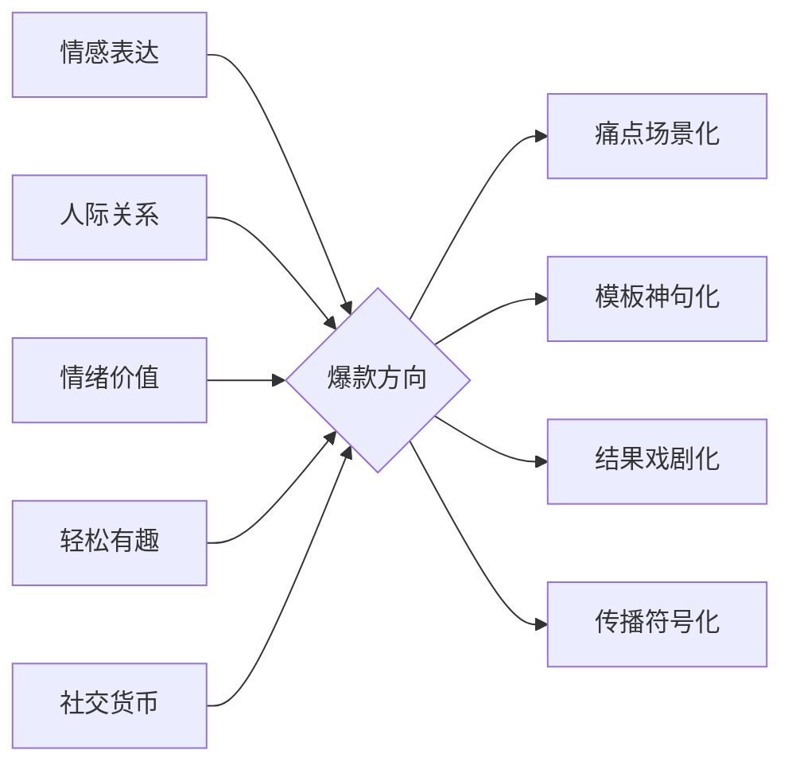

# Who

[toc]

## 名称/简介

> 固定模板的情感表达工具，投递/签收生活中“难以当面开口”表达的模板文熊熊主题卡片，关注于 职场突围、亲密关系、朋友社交、自我疗愈

名称：熊熊卡

### 简介

> 熊熊卡：微信小程序，情感化工具，其主要功能为 投递/签收聚焦于“难以当面开口”表达场景模板文的情感卡片。页面设计：暖色系，橙色/黄色。I

“情感化工具型设计”：以极简框架承载功能，通过文案与 IP 传递温度，平衡效率与人文关怀。目标明确服务于“社交尴尬”场景，符合 Z 世代对轻松社交产品的需求。
主题色：暖色系（如橙色/黄色呼应“暖暖熊”IP）。

说不出口的感谢、歉意、鼓励？用熊熊卡！500+暖心模板，覆盖职场突围（改 PPT/加班协助）、亲密关系（道歉/爱意）、朋友社交、自我疗愈场景。感谢卡、道歉卡、夸夸卡、能量卡...一键投递，温暖表达超简单！橙色治愈设计，让心意轻松抵达。🔥
熊熊卡｜治愈系情感卡片小程序

职场感谢、道歉、鼓励，朋友安慰、社交破冰，亲密爱意表达... 那些难开口的话，让熊熊卡替你说！提供丰富模板（感谢/道歉/鼓励/拒绝/纪念等），覆盖职场突围、亲密关系、朋友社交等场景。暖心设计，一键投递心意，化解表达尴尬！

### 业务

> 微信小程序介绍 120 字内

-   卡分类：职场突围, 亲密关系, 朋友社交, 自我疗愈, 通用场景

-   卡类型：感谢卡, 鼓励卡, 夸夸卡, 道歉卡, 拒绝卡, 纪念卡, 自嘲卡, 抱抱卡, 能量卡, 轻效卡, 任务卡, 学习卡, 疗愈卡, 建议卡

-   卡主题：改 PPT 之恩, 带饭之恩, 加班协助, 项目支持, 任务延期, 沟通失误, 会议提醒, 进度同步, 流程优化, 改进建议, 日常小确幸, 特殊成就, 安慰鼓励, 表达爱意, 忘记纪念日, 无心之失, 周年纪念, 特殊日子, 能量补给, 加油打气, 养育之恩, 成长灯塔, 带饭之恩, 拒绝借钱, 拒绝邀约, 化解尴尬, 幽默破冰, 考试加油, 面试鼓励, 周年纪念, 特殊日子, 帮助感谢, 礼物致谢, 安慰朋友, 表达支持, 自我激励, 能量补充, 化解失败, 幽默解压, 自我肯定, 成就庆祝, 压力释放, 心灵充电, 学习计划, 知识总结, 即时修复, 温柔界限, 温暖相助, 追光而行, 魔法时刻, 智慧婉拒, 雨后彩虹

难开口？派熊出征！👉 小程序 🔍 【熊熊卡】

#### 方案一：更聚焦核心痛点 & 行动号召

难开口？🐻💥 派熊出征！👉【熊熊卡】
📚 高情商弹药库：感谢/道歉/鼓励/夸夸…所有“开不了口”，现成模板替你得体表达！
🐾 熊系治愈力：软萌画风+暖心文案，沟通秒变治愈现场 ✨
🚀 两步搞定：选卡 → 放熊！🔥

#### 方案二：强调“熊”的身份 & 情感价值

开不了口？🆘 你的嘴替熊熊已上线！👉【熊熊卡】
📚 高情商话术库：感谢/道歉/鼓励/夸夸…“难言时刻”，熊熊替你暖心表达 ❤️
🐻❄️ 软萌暴击：熊系画风+治愈文案，冰冷沟通瞬间融化 ☀️
✅ 超简单：1 选卡 →2 放熊！Go！

#### 方案三：强调“熊”的身份 & 情感价值

🐻🔥 开不了口？放熊！👉【熊熊卡】
💌 万能情感模板：感谢/道歉/鼓励/夸夸…难言时刻，熊熊替你搞定！
✨ 软萌治愈力：熊系画风+文案，沟通秒升温~
🚀 两步神操作：选卡 → 放熊！So Easy！

你的社恐嘴替，已熊化上线
说不出口的话，交给熊熊说
你的嘴替，是只熊
社恐退散！熊式沟通已加载
言棘于齿？以熊为舟
戳熊！让难开口变好开口
开不了口？放熊出马，一卡通关

“三步驯服开不了口：选卡 → 改字 → 放熊！”
“有些话不必亲口说，但必须好好说” + 熊递卡插图
戳熊代说 / 放熊出马

按钮文案“派熊出征”

分享文案：
“刚用熊熊卡发了不敢说的道歉…居然被夸情商高？🐻✨”
“建议焊在微信里！社恐的嘴替是只熊”

**新核心思路：聚焦“情感表达”、“人际关系”、“情绪价值”、“轻松有趣”、“社交货币”、“难以当面开口”、“独特关系仪式感”**

## 垂类赛道精准定位

> **情感表达的“破冰者”与“仪式感引擎”**，化解表达尴尬，创造关系仪式感

合集沉淀：
创建“难以当面开口的话的 100 种说法”收藏夹，成为平台情感垂类必备素材库
🐻 熊熊卡｜高情商表达小帮手
感谢/鼓励/夸夸/拒绝/道歉 五大主题

### 核心用户痛点锚定

## 内容调优宝典 📚

-   选题
-   标题优化：明确受众的对象，或 疑问句结尾，增加互动率
-   视觉呈现：重点突出、剪辑流畅、富有创意、画面清晰
-   干货分享：向粉丝提供有价值的内容，使用技巧、独家见解
-   侧重点：

    -   视频博主：关注时长和画面比例是否合适，开头吸引力强，内容紧凑
    -   图文博主：图片构图，笔记的文字排版，通过分点和分段的方式，提升读者的阅读体验，让内容更加详略得当

-   封面优化
    -   竖版封面尺寸 3:4，横版封面尺寸 4:3
    -   封面文案：凝练清晰，总体不超过 10 个 字，单行不超过 5 个字（视觉焦点）

## 好的文案怎么写？

① 有用性。文案与图片相关、反映真实体验，详实有用，让用户看完后有收获；可尝试使用有趣、生活化，或是带有个人特色的文风更加分~
② 可读性。文案呈现样式详略得当、段落分明、重点清晰，整体有较强的可读性。
💡 通过适当分段、使用 emoji 等方式来「美化」文案，提升可读性；
💡 在每段的第一句突出内容重点与核心，能更清晰的向用户传达整段的内容信息；
💡 文案与图片顺序相关联，能给用户更好的阅读体验

## 粉丝维护心法

-   明确账号定位，了解粉丝需求
-   及时回复粉丝
-   定时更新，呼吁关注

## 小红书爆款视频公式

-   选题策划：受众需求+热点话题+个人特色=爆款选题，**垂类赛道**
-   完美内容：开头吸睛+中间充实+结尾互动=完美内容

    -   突出重点+调动情绪（感染力的词汇）+结合场景=标题封面
    -   发布时间：
        -   8:00 ~ 9:00：小黄金时间段，大多数人可能在吃早饭挤地铁，碎片时间充足
        -   12:00 ~ 14:00：中黄金时间段，午休时间
        -   15:00 ~ 16:00：小黄金时间段，临近下班
        -   18:00 ~ 20:00：中黄金时间段，下班时间段
        -   20:00 ~ 21:30：大黄金时间段，闲暇状态
        -   22:00 ~ 24:00：个别赛道可发，情绪主导时间，适合推送情感内容

-   吸粉内容
    -   寻找大众领域的小众内容
    -   挖掘小众领域的内容
    -   找一个喜欢的创作者作为参考对象

## 快手

-

## 爆款内容四维模型

## 平台特性与内容适配策略

| 平台   | 内容偏好             | 封面/标题技巧                                                                              | 发布时间建议                                                                                    |
| ------ | -------------------- | ------------------------------------------------------------------------------------------ | ----------------------------------------------------------------------------------------------- |
| 小红书 | 实用清单+情感共鸣    | ⭐ 高对比度封面+痛点关键词（如“不会道歉？1 张熊熊卡化解冷战”）                             | 标题结构：”场景+情绪+解决方案“（例：”闺蜜生气了？3 步高情商道歉模板“） 早 7-9 点、晚 7-10 点 19 |
| 抖音   | 悬念前置+即时价值    | 🔥 首图动态文字（如滚动条“难开口 → 轻松说”）                                               | 标题钩子：疑问句+emoji（例：”得罪领导怎么办？🔥 熊熊卡救场话术“） 工作日晚 7-9 点（知识类）28   |
| 快手   | 真实故事+方言元素 💬 | 封面真人手持卡片+方言标语（如”东北老铁：这话忒难说，用卡老好使！“）                        | 内容侧重：用户证言+生活化场景 周末早 10 点 26                                                   |
| 微博   | 热点关联+争议话题    | ⚡ 九宫格排版（1 张产品图+8 个使用场景）                                                   | 标题：”社交恐惧？用熊熊卡解高情商表达“+热搜话题（如#职场沟通） 午间 12-14 点 69                 |
| 视频号 | 深度解析+私域导流    | ✉️ 首图突出福利（”扫码领 10 个万能话术模板“） ，内容设计：痛点故事+解决方案+公众号跳转链接 | 晚 8-10 点（家庭/情感话题）                                                                     |
