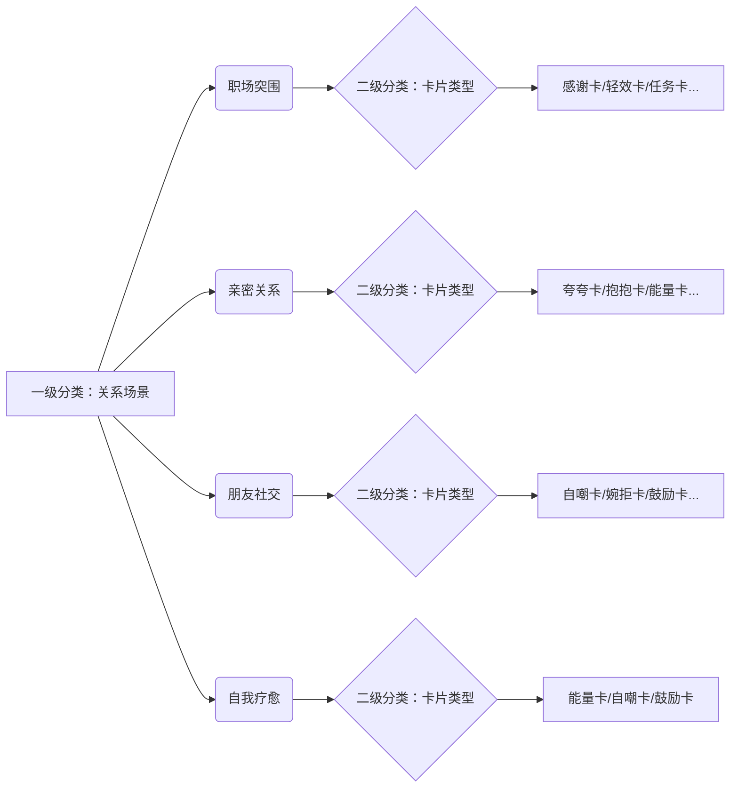

### **一、一级分类优化：按「关系场景」切割（用户第一直觉）**

| **一级分类** | 核心逻辑               | 覆盖卡片类型（二级分类）                         |
| ------------ | ---------------------- | ------------------------------------------------ |
| **职场突围** | 利益导向，需谨慎措辞   | `感谢卡`、`道歉卡`、`婉拒卡`、`轻效卡`、`任务卡` |
| **亲密关系** | 情感导向，重温度传递   | `夸夸卡`、`抱抱卡`、`道歉卡`、`纪念卡`、`能量卡` |
| **朋友社交** | 边界导向，怕伤情面     | `婉拒卡`、`自嘲卡`、`鼓励卡`、`感谢卡`、`抱抱卡` |
| **自我疗愈** | 新增场景！关怀内向人群 | `能量卡`、`自嘲卡`、`鼓励卡`（_给自己发卡_）     |

> ✅ **创新点**：
>
> -   将`能量卡/自嘲卡`从功能卡升级为**自我关怀入口**，切中当代人情绪自救需求
> -   `轻效卡`专攻职场——用于“会议提醒”“进度同步”等无情感负担的模板

---

### **二、高频卡片类型运营策略（解决选择困难）**

#### **1. 道歉卡/拒绝卡：刚性需求前置化**

-   **痛点**：用户带着明确负向目的而来，需最快触达
-   **方案**：
    -   在所有场景一级页，**固定顶部快捷入口**：  
        `🔥 急需开口｜[道歉] [拒绝] 快速模板通道`
    -   根据场景自动匹配文案（如职场拒绝卡默认带“工作饱和度”话术）

#### **2. 自嘲卡/抱抱卡：社交破冰神器**

-   **定位**：化解尴尬的“软性武器”，适合分享传播
-   **运营设计**：
    -   朋友社交页置顶标语：**“用自嘲破冰，用抱抱升温”**
    -   生成页添加梗图彩蛋（如自嘲卡配“躺平熊”表情包）

#### **3. 轻效卡/任务卡：职场专属利器**

-   **场景方案**：
    ```markdown
    [职场关系] → 二级分类「高效协作」  
     ├─ 轻效卡：会议通知/进度同步等中性沟通  
     └─ 任务卡：分工确认/截止提醒等责任声明
    ```
-   **卡片设计**：采用冷色系+文档图标，与情感卡区分

---

### **三、低频卡片激活策略**

| **卡片类型** | 痛点               | 激活方案                               | 案例主题                    |
| ------------ | ------------------ | -------------------------------------- | --------------------------- |
| **纪念卡**   | 使用频次低，易埋没 | 绑定节日推送（情人节/毕业季）          | “和熊见证的第 365 天”       |
| **能量卡**   | 概念抽象           | 改名**能量卡**+场景化（考试周/加班夜） | “凌晨 2 点的代码，熊陪你扛” |

---

### **四、卡片组合拳玩法（提升黏性）**

#### **场景解决方案包：**

> **“高情商拒绝三件套”**
>
> 1. `婉拒卡`：核心话术（“近期工作饱和无法承接...”）
> 2. `轻效卡`：替代方案（“推荐联系 XX 同事”）
> 3. `抱抱卡`：情绪安抚（“下次撸串我请客！”）

#### **情感链路工具包：**

> **“道歉-补救-翻篇”组合**
>
> 1. `道歉卡`：承认错误
> 2. `能量卡`：补偿行动（“送你一杯奶茶券补血”）
> 3. `自嘲卡`：幽默收尾（“本熊已自闭罚站 1 小时”）

---

### **五、视觉符号强化记忆**

| **卡片类型** | 符号              | 用户心智植入         |
| ------------ | ----------------- | -------------------- |
| 道歉卡       | 🐻➕💧（流泪熊）  | “熊在替我哭诉歉意”   |
| 婉拒卡       | 🐻➕🛡️ （举盾熊） | “熊盾牌挡住尴尬”     |
| 能量卡       | 🐻➕⚡（充电熊）  | “熊牌充电宝注入能量” |

> **交互提示**：当用户停留选择>5 秒，弹出熊头气泡：  
> _“需要开口急救？试试【拒绝卡+抱抱卡】组合拳！🐻✨”_

---

### **总结：产品架构全景图**



**最终体验目标**：  
➤ **负向需求**（道歉/拒绝）：3 步内完成（场景 → 快捷入口 → 模板）  
➤ **正向需求**（感谢/夸夸）：制造惊喜感（文案+视觉彩蛋）  
➤ **抽象需求**（充能/自嘲）：通过场景包和组合拳降低理解成本
