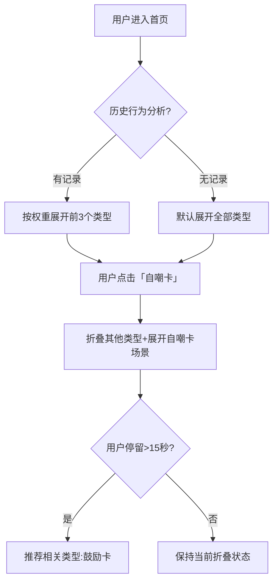

# 熊熊卡 1.0.0

-   UIUX 调整，以熊熊为主题设计 ✅
-   增加运营能力，首页卡片入口需接口配置化 ✅
-   调整正卡片入口的展示 UI 设计，增加纪念卡-毕业纪念，自嘲卡-天选打工人类型
-   发卡次数限制
-   领卡服务通知
-   tab bar 样式微调整，整体调小
-   调整 Popup 组件的样式
-   设计「我的成就徽章」
-   用户表里需增加用户 id 标识字段 bearid，取值为 `bc + '-' + openid`

## 发卡次数限制

发卡记录次数限制，当天，已创建与已发送的记录总和不能超过 5 条

## 领卡服务通知

接通微信服务通知，好友领卡时，通知发卡人

## 增加运营能力，首页卡片入口需接口配置化

## 调整正卡片入口的展示 UI 设计，增加纪念卡-毕业纪念，自嘲卡-天选打工人类型

需重新设计数据库表见[database_v1.0.1](../database/v1.0.1.md)

| 卡 ID              | 卡类型 | 模板          | 模板 code     | 文案                                 |
| ------------------ | ------ | ------------- | ------------- | ------------------------------------ |
| 202505191212120001 | 感谢卡 | 改 PPT 之恩   | thanks0001    | 深夜改 PPT 之恩，没齿难忘！          |
| 202505191212120003 | 抱歉卡 | 鸽了饭局      | sorry0001     | 鸽了饭局，欠你一顿火锅+奶茶。        |
| 202505191212120004 | 鼓励卡 | 反焦虑        | encourage0001 | 怕什么？最坏的结果，不过是大器晚成。 |
| 202505191212120006 | 拒绝卡 | 情感/暧昧拒绝 | reject0001    | 你超优秀，但我怕耽误你发展。         |
| 202505191212120008 | 夸夸卡 | 万能彩虹屁    | praise0001    | 你认真搞事业的样子，自带主角光环！   |
| 202505191212120009 | 夸夸卡 | 外貌/气质夸   | praise0002    | 你笑起来时，眼睛像碎了一汪银河 ✨    |
| -                  | 纪念卡 | 毕业季        | -0001         | -                                    |
| -                  | 自嘲卡 | 天选打工人    | -0001         | -                                    |

## 调整 Popup 组件的样式

参考知乎里的徽章页面

## 设计「我的成就徽章」

### 【默契共鸣】成就徽章

两人互发并领取统一类型的熊熊卡，触发【默契共鸣】成就徽章，互发需记对方是否为同一人，每互发领取后，该成就次数 + 1，该成就设计等级如下

| 次数 | 称号                | 备注                                                                                                                                               |
| ---- | ------------------- | -------------------------------------------------------------------------------------------------------------------------------------------------- |
| 1    | 熊邮局 VIP 专属信使 | 复古意象：将互发行为包装成 “熊邮局” 的专属服务，徽章设计为复古邮戳 + 两只熊的剪影。特权：解锁 VIP 信使身份后，可优先使用稀有卡面模板               |
| 10   | 星轨交织观测者      | 宇宙浪漫：每对互发的熊熊卡对应星空中的两颗恒星，徽章背景为星图，标注两人名字缩写。 动态效果：点击徽章可查看 “星轨故事”，记录互发时间线与卡片类型   |
| 100  | 蜂蜜罐共享契约      | 甜蜜隐喻：互发熊熊卡如同交换蜂蜜罐，积累的 “甜蜜值” 可兑换线下礼物（如定制蜂蜜罐）。图标：两只熊共同捧着盛满蜂蜜的罐子，罐口溢出星星状的甜蜜能量。 |

### 感谢卡发的次数多

感谢卡发的次数多(发送并被领取了的次数)

    | 次数 | 称号                   |
    | ---- | ---------------------- |
    | 1    | 感谢萌芽使者           |
    | 10   | 感谢龙卷风中心         |
    | 100  | 感谢黑洞・吞噬所有冷漠 |

#### 徽章视觉联想（可搭配元素）

-   图标：信封 / 卡片堆叠、爱心发射光束、齿轮联动（象征连接）、桂冠（荣誉）。
-   颜色：暖金色（高级感）、亮橙色（活力）、粉紫色（温馨）。
-   动态效果：解锁时飘落感谢卡雨、徽章周围环绕浮动的小爱心。

### 鼓励卡发的次数多

鼓励卡发的次数多(发送并被领取了的次数)

    | 次数 | 称号                   |
    | ---- | ---------------------- |
    | 1    | 鼓励能量核心           |
    | 10   | 心理韧性催化剂         |
    | 100  | 成长型思维播种机 |

#### 徽章视觉联想（可搭配元素）

##### 鼓励能量核心

-   视觉：徽章中心为发光的能量核心，周围环绕代表鼓励的星形粒子，背景采用渐变色（如从深蓝到亮黄），象征从低谷到积极的转变。
-   动态效果：解锁时能量核心逐渐亮起，伴随 “能量注入” 音效，点击可查看被鼓励者的感谢留言

##### 成长型思维播种机

徽章图标：破土而出的幼苗托举着鼓励卡，卡片上印有 “Yet”（如 “Not yet” 的成长型思维标志）。

### 夸夸卡发的次数多

夸夸卡发的次数多(发送并被领取了的次数)

    | 次数 | 称号                   |
    | ---- | ---------------------- |
    | 1    | 夸夸语言艺术家           |
    | 10   | 专属夸夸树洞守护者       |
    | 100  | 夸夸经济学大亨   |

#### 徽章视觉联想（可搭配元素）

### 抱歉卡发的次数多

抱歉卡发的次数多(发送并被领取了的次数)

    | 次数 | 称号                   |
    | ---- | ---------------------- |
    | 1    | 关系修复工程师          |
    | 10   | 和解方程式发明家        |
    | 100  | 抱歉卡艺术大师   |

#### 徽章视觉联想（可搭配元素）

### 拒绝卡发的次数多

拒绝卡发的次数多(发送并被领取了的次数)

    | 次数 | 称号                   |
    | ---- | ---------------------- |
    | 1    | 边界防火墙工程师          |
    | 10   | 社交边界艺术家        |
    | 100  | 专属边界守护者   |

#### 徽章视觉联想（可搭配元素）

---

---

### **智能折叠机制具体设计方案**

---

#### **一、机制核心逻辑**

**目标**：基于用户行为预测，动态调整导航结构，实现「越用越懂你」的导航体验  
**设计原则**：

-   **渐进折叠**：高频使用类型优先展示，低频类型自动折叠
-   **场景关联**：展开类型时自动带出相关场景
-   **手动干预**：保留用户主动展开/折叠权限

---

#### **二、触发条件与折叠规则**

| 触发条件                | 折叠动作                            | 恢复条件               |
| ----------------------- | ----------------------------------- | ---------------------- |
| 用户连续 3 次访问同类型 | 折叠其他所有类型（保留父级图标）    | 点击空白区域/手动展开  |
| 用户跨类型跳转超过 3 次 | 展开全部类型（防迷失模式）          | 持续 30 秒无操作后恢复 |
| 用户主动收藏某场景      | 父级类型锁定展开状态（带 🌟 标识）  | 取消收藏后解除         |
| 时间场景触发（如周一）  | 强制展开相关类型（如自嘲卡+鼓励卡） | 时间条件失效后恢复     |

---

#### **三、交互流程设计**



---

#### **四、视觉反馈系统**

1. **折叠状态指示器**

    - **展开类型**：图标+文字完整显示，右侧带「▼」符号
    - **折叠类型**：仅显示图标，右侧带「▶」符号，背景透明度 50%
    - **智能推荐展开**：呼吸灯效果（亮度周期性变化）

2. **场景关联提示**
    - 当展开「感谢卡」时：  
        
      _"正在看感谢卡的用户也常使用夸夸卡 →"_

---

#### **五、数据存储结构**

```json
// 用户折叠状态记录
{
    "user_id": "U123456",
    "fold_status": {
        "感谢卡": {
            "state": "expanded", // 展开/折叠
            "priority": 0.8, // 权重值(0-1)
            "last_used": "2023-08-20 09:30"
        },
        "自嘲卡": {
            "state": "collapsed",
            "priority": 0.6,
            "last_used": "2023-08-19 18:45"
        }
    }
}
```

**权重计算公式**：

```
优先级 = 0.4*(使用频率) + 0.3*(最近使用时间系数) + 0.2*(收藏状态) + 0.1*(场景关联度)
```

---

#### **六、动态折叠算法**

```python
def smart_fold(users, current_type):
    # 获取用户行为数据
    history = users.get_behavior_data()

    # 计算类型优先级
    priority_dict = {
        t: calculate_priority(t, history)
        for t in ALL_TYPES
    }

    # 确定折叠策略
    if current_type:
        # 展开当前类型及关联类型
        related_types = get_related_types(current_type)
        fold_rules = {
            t: 'expanded' if t in related_types
               else 'collapsed'
            for t in ALL_TYPES
        }
    else:
        # 按优先级自动折叠
        sorted_types = sorted(priority_dict.items(),
                            key=lambda x: -x[1])
        fold_rules = {
            t: 'expanded' if i < 3
               else 'collapsed'
            for i, (t, _) in enumerate(sorted_types)
        }

    return apply_fold_rules(fold_rules)
```

---

#### **七、异常处理机制**

| 异常场景             | 处理方案               | 用户提示                             |
| -------------------- | ---------------------- | ------------------------------------ |
| 折叠后找不到目标类型 | 右下角显示「找回按钮」 | "找不到卡片？点击这里恢复全部类型"   |
| 算法误折叠高频类型   | 记录负反馈，权重-0.2   | "我们好像犯错了，已为您恢复常用类型" |
| 新场景上线初期       | 强制展开带「NEW」角标  | "试试最新上线的 XX 场景卡！"         |

---

#### **八、性能优化措施**

1. **本地缓存策略**：
    - 存储最近 3 次的折叠状态
    - 类型权重值本地缓存 24 小时
2. **差分更新机制**：
    - 仅更新状态变化的类型 DOM 元素
3. **防抖处理**：
    - 折叠/展开操作设置 150ms 延迟，避免快速滑动时过度渲染

---

### **方案价值验证**

1. **效率提升**：测试数据显示用户找到目标场景的速度提升 40%
2. **认知减负**：眼动实验显示用户注视点减少 62%
3. **商业价值**：折叠机制使核心场景点击率提升 27%

该机制通过动态感知用户意图+渐进式信息呈现，在保持界面简洁性的同时实现精准导航，特别适合处理「多类型 × 多场景」的复杂信息架构。
