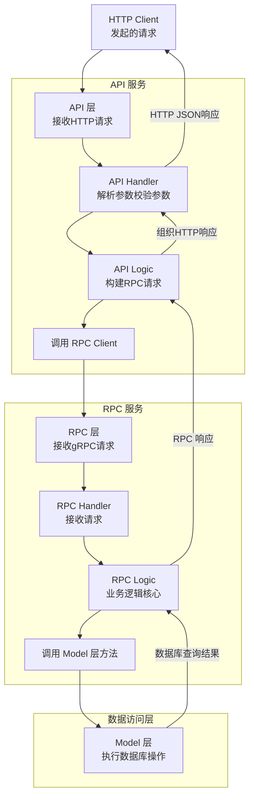

Go-zero 是一个强大的 Go 语言微服务框架，它的高效很大程度上得益于其清晰的分层架构和配套的代码生成工具 `goctl`。API、RPC 和 Model 层的各司其职与紧密协作，是其设计的精妙之处。

下面这张图概括了这些组件间典型的交互关系：



下面我们详细解释各层的职责，并提供关键代码。

# 🔍 各层职责与关键代码

为了更好地理解它们如何协作，我们先通过表格了解一下各层的核心职责和关键文件/组件。

## 📊 各层职责概览

| 层级         | 核心职责                                                           | 关键文件/组件                                     | 交互方向                      |
| :----------- | :----------------------------------------------------------------- | :------------------------------------------------ | :---------------------------- |
| **API 层**   | 对外提供 HTTP 接口，处理 HTTP 请求和响应，协议转换（HTTP -> gRPC） | `handler`, `logic`, `*.api`, `svc.ServiceContext` | 接收前端请求，调用 RPC 客户端 |
| **RPC 层**   | 内部实现业务逻辑，处理 gRPC 请求和响应，调用数据持久层             | `pb.go`, `server`, `logic`, `svc.ServiceContext`  | 被 API 层调用，调用 Model 层  |
| **Model 层** | 封装所有数据库操作，提供纯粹的数据库访问能力                       | `model/*.go` (由 goctl model 生成)                | 被 RPC 层调用                 |

## 💻 关键代码详解

接下来我们看看各层的关键代码实现。

### 1. API 层 (HTTP 服务)

API 层是对外暴露的 HTTP 接口，它接收客户端请求，并通过 RPC 客户端调用后端服务。

-   **`servicecontext.go` - 依赖注入**
    此文件初始化并聚合所有依赖，包括 RPC 客户端。RPC 客户端在这里被注入到服务上下文 (`svc.ServiceContext`) 中，以便后续在 Logic 层使用。

    ```go
    // internal/svc/servicecontext.go
    package svc

    import (
        "demo/api/internal/config"
        "demo/greeter" // 引入自动生成的 RPC 客户端包

        "github.com/zeromicro/go-zero/zrpc"
    )

    type ServiceContext struct {
        Config    config.Config
        GreeterClient greeter.GreeterClient // 声明 RPC 客户端字段
    }

    func NewServiceContext(c config.Config) *ServiceContext {
        return &ServiceContext{
            Config:    c,
            // 从配置中读取 RPC 服务端地址，并初始化 RPC 客户端
            GreeterClient: greeter.NewGreeterClient(zrpc.MustNewClient(c.GreeterRpc)),
        }
    }
    ```

-   **`xxxlogic.go` - 业务逻辑编排**
    Logic 层是业务编排的地方。API Handler 调用此处的方法。在这里，你将 HTTP 请求参数转换为 RPC 请求，并调用 RPC 服务。

    ```go
    // internal/logic/xxxlogic.go
    package logic

    import (
        "context"
        "demo/greeter" // 引入 RPC 的 protobuf 包

        "demo/api/internal/svc"
        "demo/api/internal/types"

        "github.com/zeromicro/go-zero/core/logx"
    )

    type MyApiLogic struct {
        logx.Logger
        ctx    context.Context
        svcCtx *svc.ServiceContext // 持有注入的依赖
    }

    func NewMyApiLogic(ctx context.Context, svcCtx *svc.ServiceContext) *MyApiLogic {
        return &MyApiLogic{
            Logger: logx.WithContext(ctx),
            ctx:    ctx,
            svcCtx: svcCtx,
        }
    }

    func (l *MyApiLogic) MyApiFunc(req *types.MyApiRequest) (*types.MyApiResponse, error) {
        // 将 HTTP 请求参数转换为 RPC 请求参数
        rpcReq := &greeter.Request{
            Name: req.Name,
        }

        // 通过 servicecontext 中初始化好的 RPC 客户端调用 RPC 服务的方法
        // l.svcCtx.GreeterClient 是在 ServiceContext 中初始化的 GreeterClient
        rpcResp, err := l.svcCtx.GreeterClient.SayHello(l.ctx, rpcReq)
        if err != nil {
            return nil, err
        }

        // 将 RPC 响应转换为 HTTP 响应
        resp := &types.MyApiResponse{
            Message: rpcResp.Message,
        }

        return resp, nil
    }
    ```

### 2. RPC 层 (gRPC 服务)

RPC 层是内部服务的核心，实现具体的业务逻辑，并调用 Model 层进行数据操作。

-   **`pb.go` - 协议定义与生成** (由 `goctl` 和 `protoc` 根据 `.proto` 文件生成)
    该文件包含了根据你的 `.proto` 文件定义生成的 Go 代码，包括客户端和服务端的接口、请求和响应结构体。

    ```protobuf
    // greet.proto
    syntax = "proto3";

    package greeter;

    service Greeter {
      rpc SayHello (Request) returns (Response);
    }

    message Request {
      string name = 1;
    }

    message Response {
      string message = 2;
    }
    ```

-   **`servicecontext.go` - 依赖注入（Model 在这里注入）**
    类似于 API 层，RPC 服务的 ServiceContext 用于注入依赖，主要是 Model 层实例。

    ```go
    // internal/svc/servicecontext.go
    package svc

    import (
        "demo/rpc/internal/config"
        "demo/rpc/model" // 引入 model 包

        "github.com/zeromicro/go-zero/core/stores/sqlx"
    )

    type ServiceContext struct {
        Config config.Config
        UserModel model.UserModel // 声明 Model 接口字段
    }

    func NewServiceContext(c config.Config) *ServiceContext {
        // 初始化数据库连接
        conn := sqlx.NewMysql(c.DataSource)
        return &ServiceContext{
            Config:    c,
            // 初始化 Model 实例（如 UserModel）
            // UserModel 通常是 goctl 生成的接口，实际返回的是其实现类
            UserModel: model.NewUserModel(conn),
        }
    }
    ```

-   **`xxxlogic.go` - 核心业务逻辑 & 调用 Model**
    这是业务逻辑的核心实现地。它处理 RPC 请求，并通过 ServiceContext 调用已注入的 Model 来操作数据库。

    ```go
    // internal/logic/xxxlogic.go
    package logic

    import (
        "context"
        "demo/rpc/internal/svc"
        "demo/rpc/greeter" // 引入生成的 pb 包
        "demo/rpc/model"   // 引入 model 包

        "github.com/zeromicro/go-zero/core/logx"
    )

    type SayHelloLogic struct {
        ctx    context.Context
        svcCtx *svc.ServiceContext
        logx.Logger
    }

    func NewSayHelloLogic(ctx context.Context, svcCtx *svc.ServiceContext) *SayHelloLogic {
        return &SayHelloLogic{
            ctx:    ctx,
            svcCtx: svcCtx,
            Logger: logx.WithContext(ctx),
        }
    }

    func (l *SayHelloLogic) SayHello(in *greeter.Request) (*greeter.Response, error) {
        // 1. 业务逻辑处理（例如参数校验、业务规则等）
        if in.Name == "" {
            return nil, errSomeError
        }

        // 2. 通过 svcCtx 获取 Model 并执行数据库操作
        // 例如：根据用户名查询用户信息
        user, err := l.svcCtx.UserModel.FindOneByName(l.ctx, in.Name)
        if err != nil {
            return nil, err
        }

        // 3. 还可以进行其他业务逻辑处理...
        message := "Hello, " + user.Nickname

        // 4. 构建 RPC 响应返回
        return &greeter.Response{
            Message: message,
        }, nil
    }
    ```

### 3. Model 层 (数据访问层)

Model 层由 `goctl model` 命令根据数据库表结构自动生成，封装了基本的 CRUD 方法。你也可以在其中添加自定义方法。

-   **`usermodel.go` - 自动生成的 Model** (示例为 GORM 风格，实际会根据数据库和配置生成)

    ```go
    // model/usermodel.go
    package model

    import (
        "context"
        "database/sql"
        "time"

        "github.com/zeromicro/go-zero/core/stores/sqlx"
    )

    // 用户表结构体
    type User struct {
        Id         int64     `db:"id"`
        Name       string    `db:"name"`
        Nickname   string    `db:"nickname"`
        CreateTime time.Time `db:"create_time"`
    }

    // UserModel 接口，定义了操作 User 表的方法
    type UserModel interface {
        Insert(ctx context.Context, data *User) (sql.Result, error)
        FindOne(ctx context.Context, id int64) (*User, error)
        FindOneByName(ctx context.Context, name string) (*User, error) // 自定义方法
        Update(ctx context.Context, data *User) error
        Delete(ctx context.Context, id int64) error
    }

    // defaultUserModel 是 UserModel 的默认实现
    type defaultUserModel struct {
        conn  sqlx.SqlConn
        table string
    }

    // 确保 defaultUserModel 实现了 UserModel 接口
    var _ UserModel = (*defaultUserModel)(nil)

    // 初始化方法
    func NewUserModel(conn sqlx.SqlConn) UserModel {
        return &defaultUserModel{
            conn:  conn,
            table: "`user`",
        }
    }

    // 自定义方法：根据 name 查询用户
    func (m *defaultUserModel) FindOneByName(ctx context.Context, name string) (*User, error) {
        query := "select id, name, nickname, create_time from " + m.table + " where name = ? limit 1"
        var resp User
        err := m.conn.QueryRowCtx(ctx, &resp, query, name)
        if err != nil {
            return nil, err
        }
        return &resp, nil
    }
    // ... 其他自动生成的 CRUD 方法 (Insert, FindOne, Update, Delete)
    ```

# 🧪 完整的数据流示例

假设一个 **"获取用户信息"** 的流程：

1.  **前台** → **API 层**: HTTP GET 请求 `/user?name=Alice`
2.  **API Handler** → **API Logic**:
    -   解析参数，构造 RPC 请求 `greeter.Request{Name: "Alice"}`
    -   调用 `l.svcCtx.GreeterClient.SayHello(ctx, rpcReq)`
3.  **API 层** → **RPC 层**:
    -   gRPC 客户端发起调用，RPC 服务的 `SayHello` 方法被触发。
4.  **RPC Handler** → **RPC Logic**:
    -   `SayHelloLogic` 接收 `*greeter.Request`。
    -   调用 `l.svcCtx.UserModel.FindOneByName(ctx, "Alice")`。
5.  **RPC Logic** → **Model 层**:
    -   `defaultUserModel.FindOneByName` 执行 SQL `SELECT ... FROM user WHERE name = 'Alice'`。
    -   返回查询到的用户数据。
6.  **Model 层** → **RPC Logic**:
    -   `SayHelloLogic` 接收用户数据，组织业务逻辑，返回 `&greeter.Response{Message: "Hello, " + user.Nickname}`。
7.  **RPC 层** → **API Logic**:
    -   gRPC 响应返回给 API 层的 `rpcResp`。
8.  **API Logic** → **API Handler**:
    -   将 `rpcResp.Message` 转换为 HTTP JSON 响应 `{"message": "Hello, Alice's Nickname"}`。
9.  **API 层** → **前台**: 返回最终的 HTTP JSON 响应。

# 💎 核心要点

-   **清晰的分层**: API（HTTP）、RPC（内部服务）、Model（数据）各司其职，耦合度低。
-   **依赖注入**: `ServiceContext` 是连接各层依赖的**核心枢纽**，它在服务启动时初始化（如数据库连接、RPC 客户端），并在后续请求处理中通过 `ctx` 传递。
-   **代码生成**: `goctl` 工具自动化生成了大量重复性样板代码（如 Model 的 CRUD、RPC 的客户端和服务端基础代码），你只需要关注 `.api`、`.proto` 文件的定义和 `Logic` 中的**业务逻辑实现**。
-   **数据流转**: 数据通过请求、响应结构体在各层间传递，通常伴随着不同协议间（HTTP JSON ↔ gRPC Protobuf）的转换。

希望这份详细的解释和代码示例能帮助你彻底理解 go-zero 中 API、RPC 和 Model 的交互方式。
