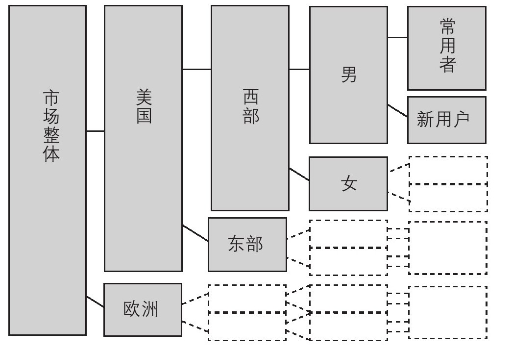
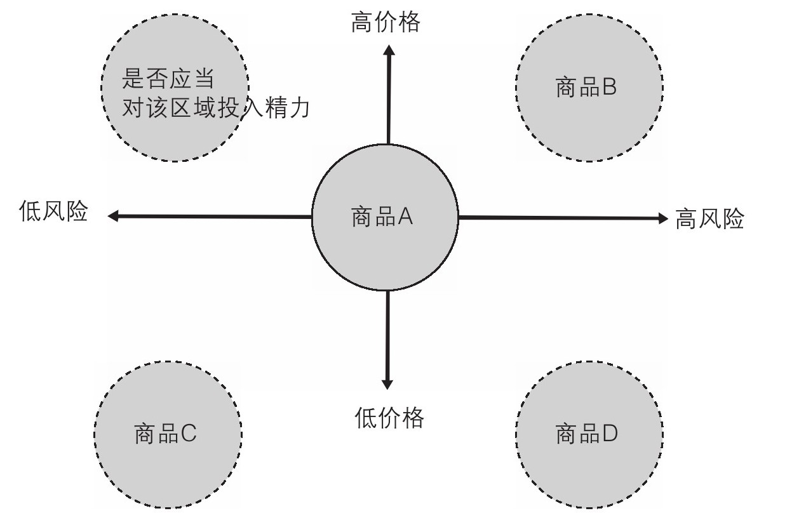
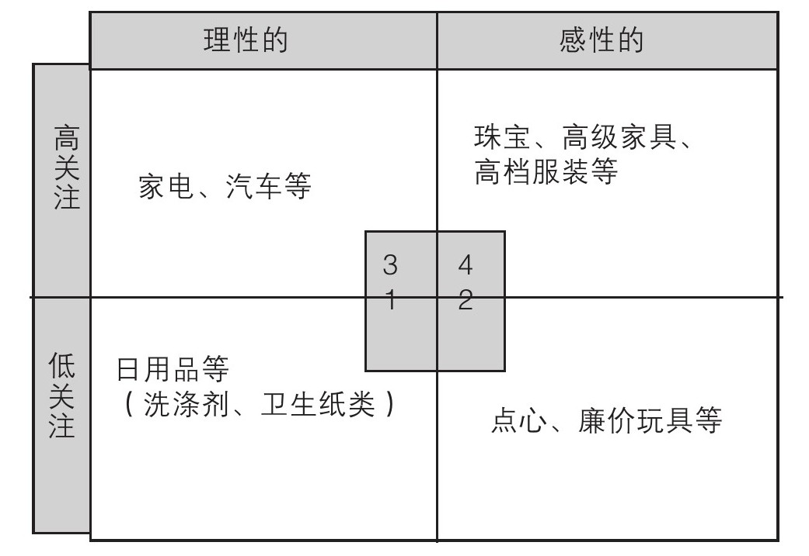
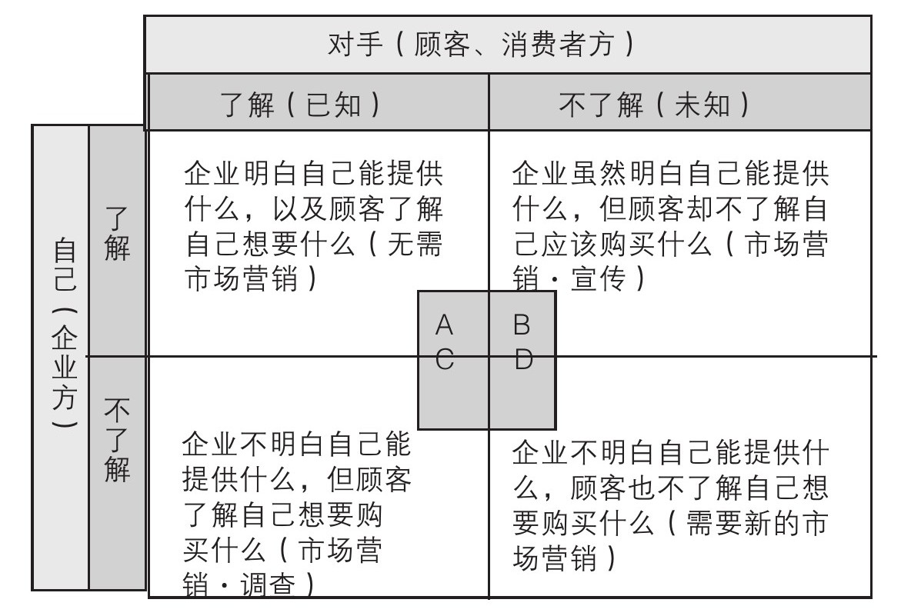
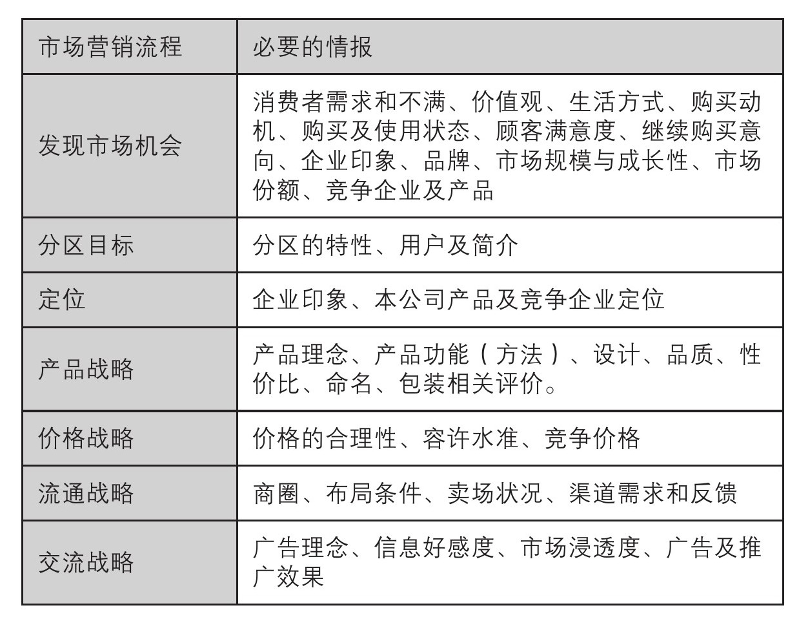
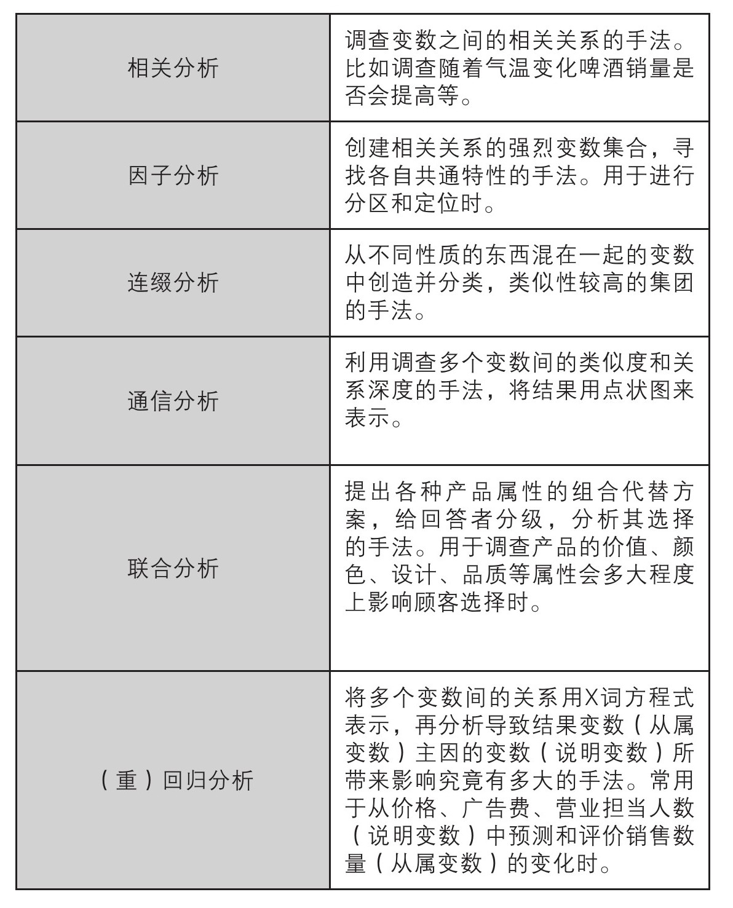

# MBA 轻松读：市场营销

[toc]

## 市场营销 1.0

> 大量生产并投放市场为中心的做法，被称为市场营销 1.0

## 市场营销 2.0

市场营销 2.0 是由企业告诉顾客“正确答案”（告知顾客应该购买什么商品），或者是由顾客告诉企业“正确答案”（了解和调查顾客想要购买什么商品）。

### 3C 分析

所谓 3C 分析，是指对公司（Company）、顾客（Customer）和竞争（Competitor）的分析。

### 市场营销 2.0 的基本概念 STP

> STP 就是指细分（Segmentation）、目标（Targeting）、定位（Positioning）的第一个字母

#### 细分（Segmentation）

S 从语义上来说是“区分（Segmentation）”市场，**在某个大型市场中可以依据地理条件、年龄性别、喜好、行动方式等因素**，将有相同需求的人分为不同集团，从而将其定义为更加“精密的市场”来掌握。简而言之，**就是将有相同喜好的人分隔开来**。

#### 目标（Targeting）

在意识到巨大市场中的“细分化小市场”之后，以此为中心精简本公司商品，从而能得出更为有效的方法。这种集中针对细分化市场的行为就被称作目标（T）。

#### 定位（Positioning）

定位一般是指决定“让顾客如何认识本公司商品”的行为。

#### 使用逻辑树来分区

图 1 使用逻辑树分区的例子

### 市场营销组合的实践（4P）

> 所谓市场营销组合，就是指“达成市场营销目标的各种可控制手段”。该手段就是 4P（product/产品、Price/定价、place/渠道、promotion/宣传），即实践各种组合而成的市场营销的意思。

#### [产品]的注意点

-   产品的基本性能
-   产品的附加性能
-   产品的形状
-   产品的附加价值（保证、报名权等）

#### [销路]的注意点

-   销售区域（地区、范围）
-   销售地点（店铺形态等）
-   销售时间
-   供应所需时间、成本

#### [宣传]的注意点

所谓宣传就是指促销活动，具体活动则是利用 CM 或广告提升产品在消费者中的认知度这类典型事例。

-   广告宣传
-   促销工具
-   包装设计
-   用途建议

> 根据目的作出决定

### 差异化的界限

> 差异化主要是向顾客表明产品的具体效用来达到推销目的

图 2 定位图

图 3 商品化的分类

-   1 为关注度较低的理性产品代表，以洗涤剂为例，即为功能性得到认可，用于日常消耗的产品类。
-   2 为关注度较低的感性产品代表，以点心为例，即为日常消耗的兴趣物品类。
-   3 为关注度较高的理性产品代表，以汽车和电视为例，即为
-   4 为关注度较高的感性产品代表，以珠宝和高级家具、高级品牌时装为例，即为能获得极大情绪性满足感的产品类。

### 品牌与品质

> 所谓品牌，就是指在想起某种产品或服务时，消费者能**对固有价值有所认知**。

-   品质价值
-   传统价值（老字号品牌等）
-   文化价值（与生活方式相结合的品牌）
-   造型价值（服装品牌）
-   羡慕价值（代表身份地位的品牌）

## 市场营销 3.0

### 参考“周哈里窗”，思考 ABCD 模式

> “周哈里窗”解释了处于交流中的自己与对手的立场。

图 4 通过“周哈里窗”思考 ABCD 模式

### 元认知

> 从高处俯瞰手段与目的之间的关系后会发现，当事者所想的事不过是单纯的手段。这种构造一般被称作“元认知”，但当事者本身往往很难注意到它。

## 市场营销调查的目的

> 目的是“为该市场营销提供参考价值”。

> 市场营销调查共有两个步骤。即“做出某种假设”和“验证该假设”。

图 5 作出市场营销战略决策时必须的情报

图 6 验证假设的常用分析手法

