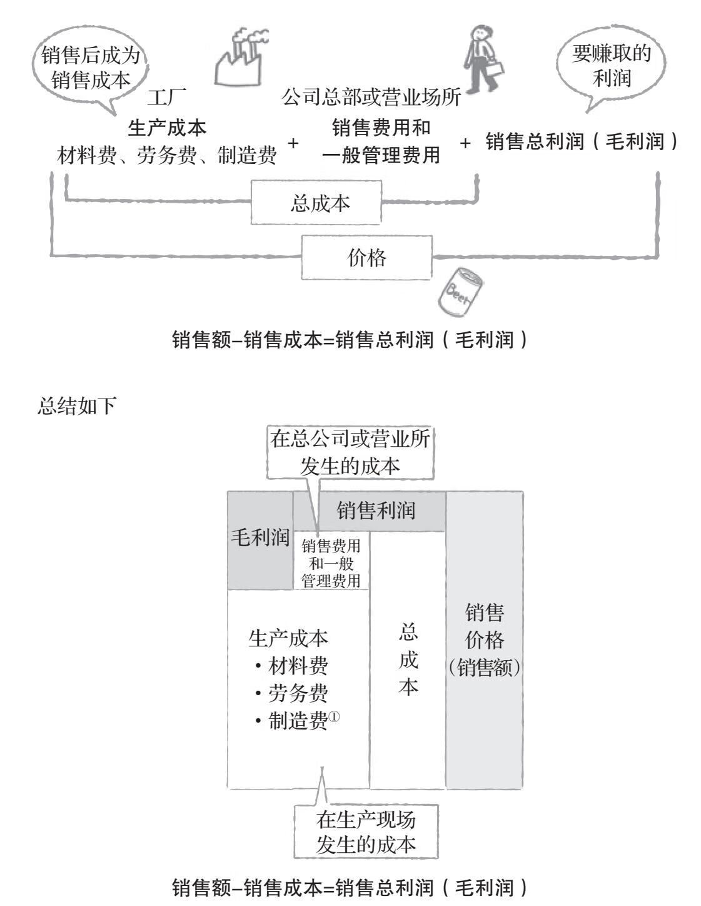
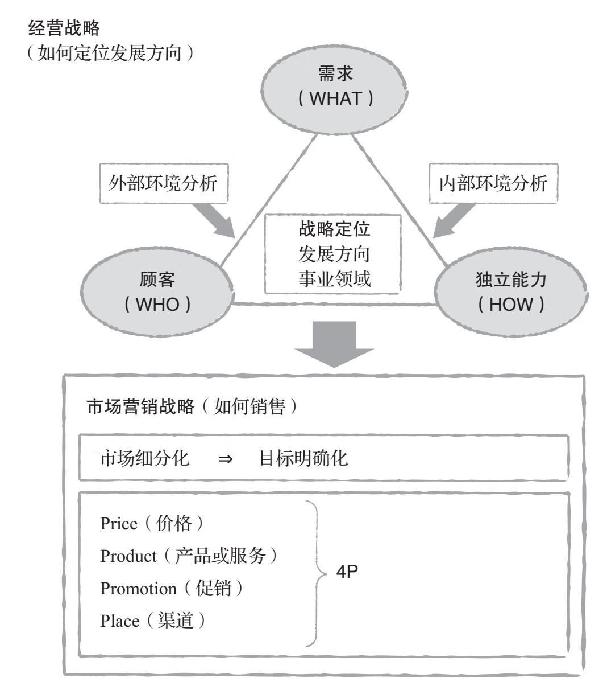
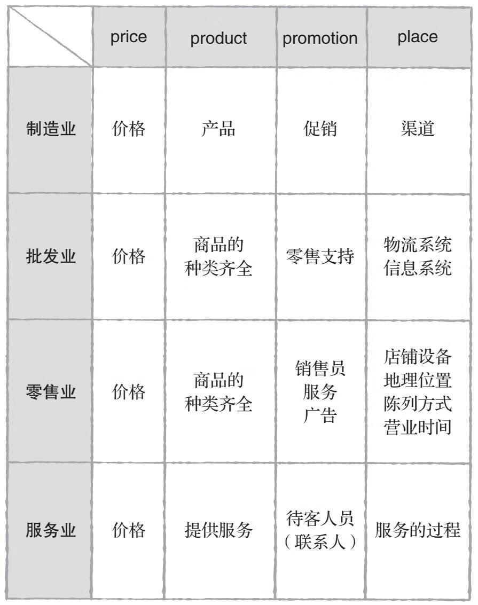
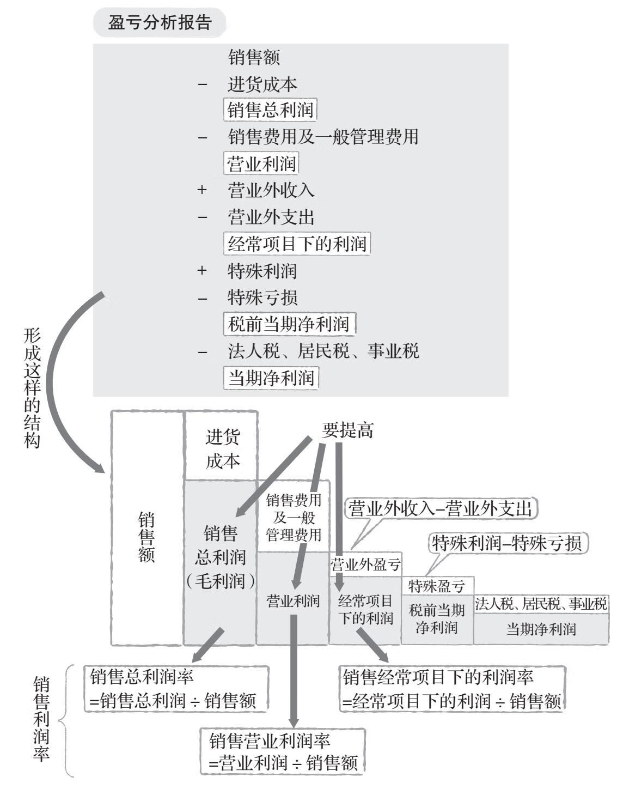
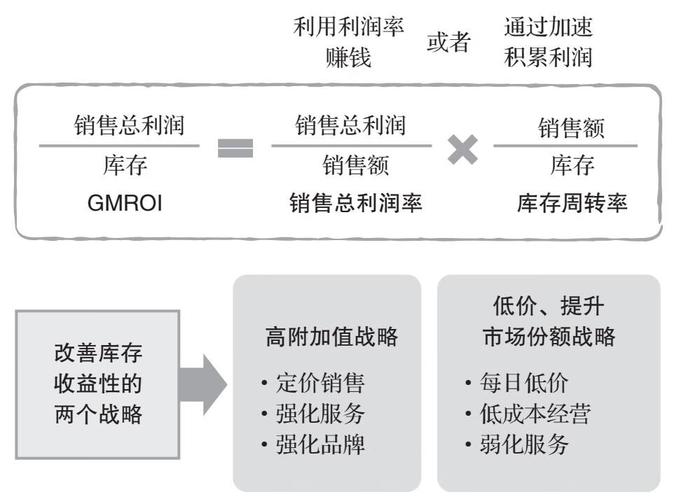

# 定价即经营

> 【日】千贺秀信， 朴丽华【译】

## 价格由三个因素决定

-   成本意识
-   需求意识
-   竞争意识

图 1 成本与价格的关系

## 战略

### 经营战略

> 经营战略是指公司通过明确发展方向而做出的决定。

在经营战略中，发展方向分为三个要素：**顾客、需求、独立能力**。
这是战略定位。在什么样的赛场上进行角逐，由这三个要素决定。

### 市场营销战略

> 市场营销战略是指在经营战略的基础上，如何销售商品和服务。如果经营战略不明确，那么市场营销战略则无法有效运行。

图 2 经营战略与市场营销战略的关系

图 3 不同行业市场营销组合

便利店是以城市为中心，抓住小商圈的购物需求而发展起来的。其战略定位是为附近的消费者（顾客）提供随时可以就近购物的便利（需求），能够长时间营业的小型商店（独立能力）。

为了实现这个战略定位，要决定出售什么样的商品、如何销售。这就是市场营销战略。出售的商品有盒饭、面包、家常菜、饮料、点心、杂志、日用品等便于就近购买的产品（product）。因为以便利性为卖点，所以便利店的商品不打折且价格偏高（price）。筛选出 3000 种畅销商品（product），而且强调容易挑选（promotion）。24 小时营业确保了满足小商圈的需求，并采用自助购物方式（promotion）。店铺面积为 100 ～ 150m2，通过在区域内集中开店的方式，大大提高了向店铺配送商品的效率（增加配送的次数，同时降低配送成本）（place）。

图 4 盈亏分析报告的结构

> 库存周转率 = 销售额 / 库存
> 库存周转天数（库存全部售完需要的天数）= 365 天 / 库存周转率

图 5 观察库存收益性的指标

