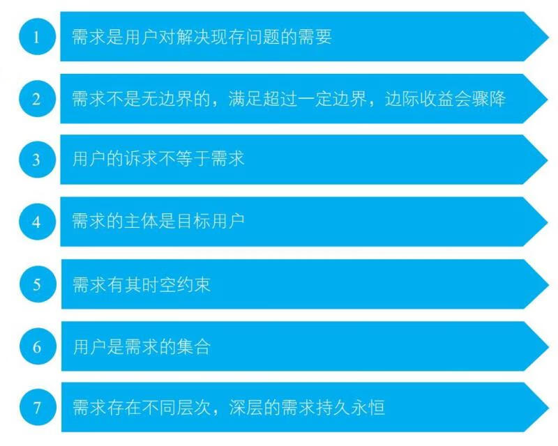
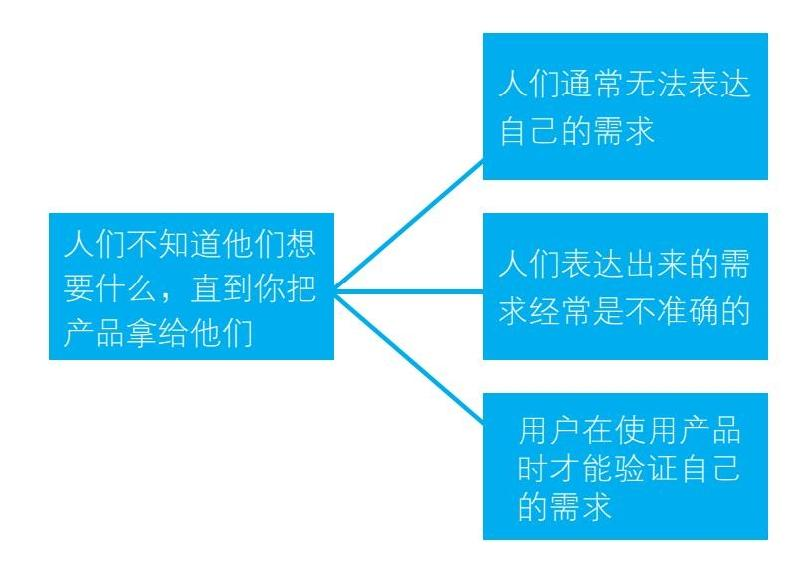
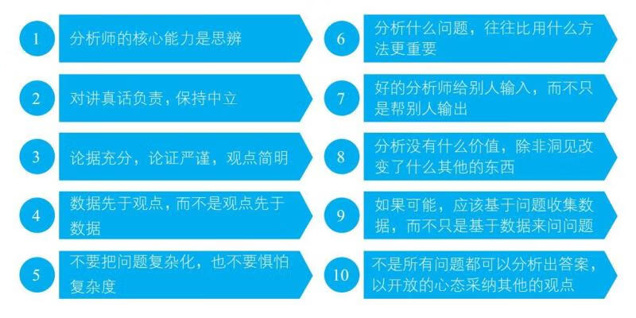

# 产品思维

> 作者：刘飞

[toc]

让一个有真实感的用户停留在我们的脑海中，在需要判断的时候让这个有真实感的用户帮助我们。同时我们也能够跟别人解释我们的用户是什么样的人，让大家脑海中都能够有这样一个用户来帮助我们做判断。

行为数据

## 从单一用户群体到用户群体矩阵多视角认知

在产品刚刚萌芽时，更多的是寻找潜在用户的群体特征，以及判断当下核心用户的特征。对于这种单一用户的群体特征，

## 利用场景判断用户的真实需求

理查德·塞勒（2017 年诺贝尔经济学奖得主）早在 1980 年就提出的心理账户，如今已经是经济学中的重要概念。心理账户指的是，哪怕都是同样面值的收入和支出，在一个人的心中，它们都被分门别类做了编码，重要程度和账户的额度截然不同。

## 找到真实有效的需求点

图 1 认知原则

> 需求：用户对解决现存问题的需要。

图 2 剖析需求

图 3  数据分析十条

