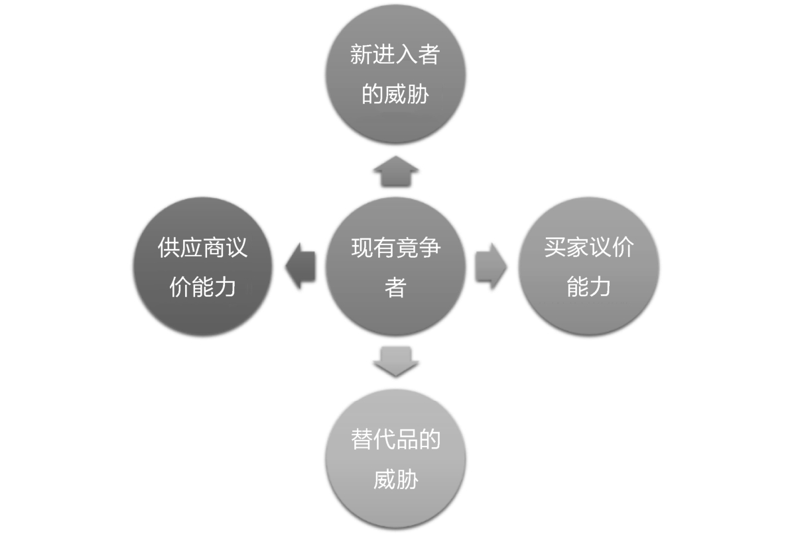
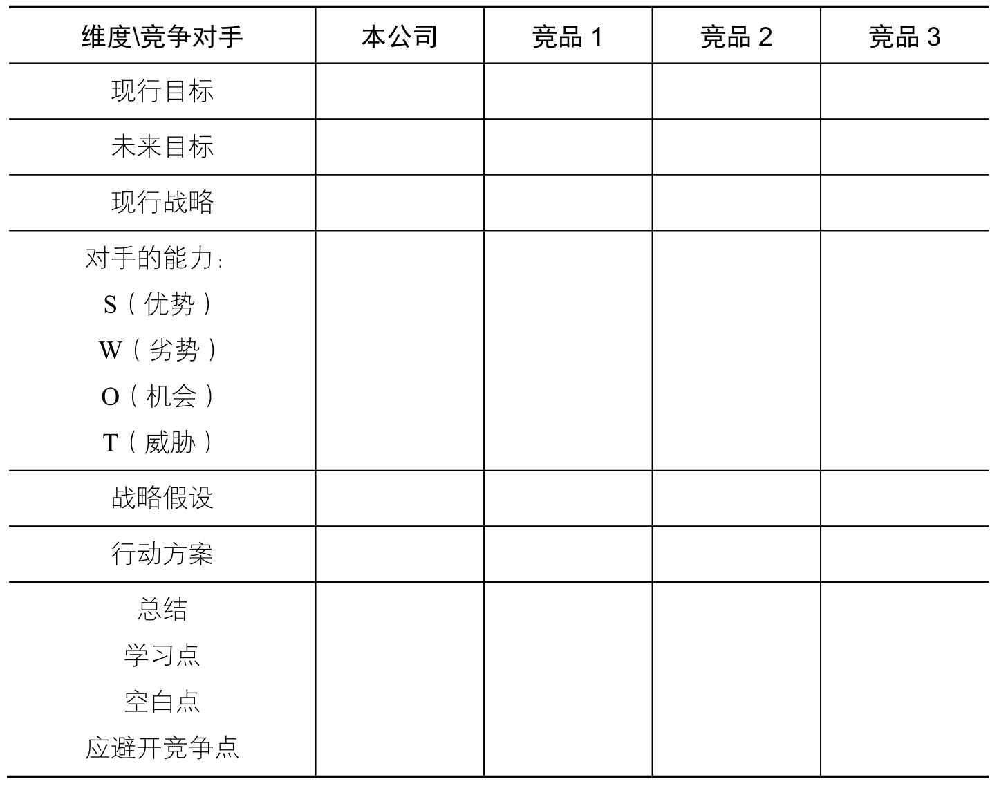
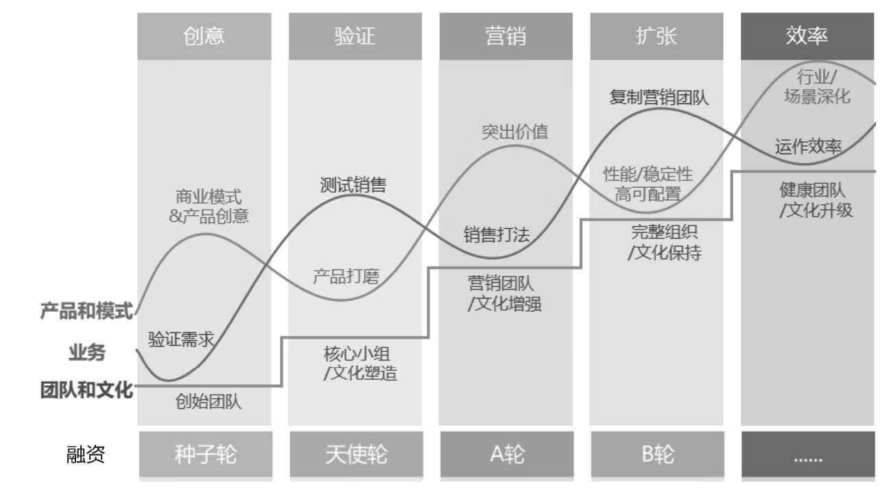
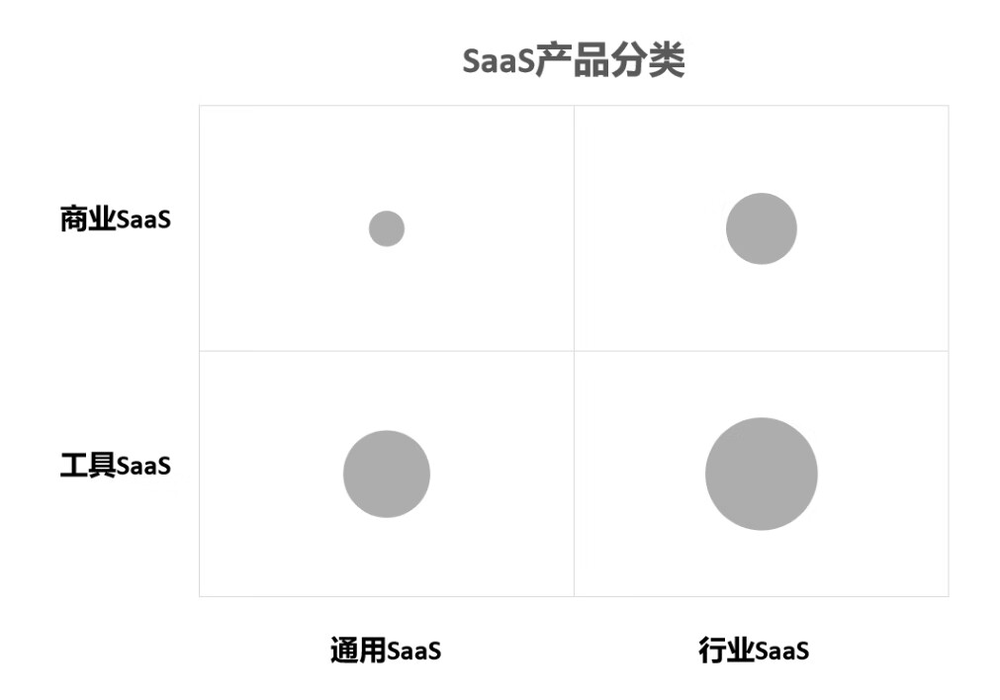

# SaaS 创业路线图

> 作者：吴昊

[toc]

> 要真正做到客户成功，3 点关键要素：
>
> -   把客户、行业和市场有深刻的洞察
> -   把洞察转化为实际解决问题的能力，并转化成标准化在线产品
> -   专业的团队

## SaaS

> SaaS：Software-as-a-Service，软件即服务源于美国 Salesforce 公司（1999 年创立）创造的新软件服务模式。即通过网络进行程序提供的服务。

SaaS 的本质是“续费”，付费租用。

AWS：Amazon Web Services，亚马孙云。

### 目标市场

-   小微企业市场
-   中部市场
-   头部市场

在“橄榄型”市场中，SaaS 公司的标准化产品能够不断从客户那里吸取养分，在形成客户满意度高的标准产品后，口碑和品牌效应也会降低获客成本，可以给 SaaS 公司带来高额回报。

与“橄榄型”相对的是“哑铃型”市场：头部企业数量不多，但占据了很大市场份额；后面还有大量长尾小微企业，也占据了一定市场份额；这样留给中间的中小企业的市场空间就不大了。

在国内，餐饮行业、教育行业、健身房门店，包括 SaaS 领域自身，都属于“橄榄型”市场；而石化、银行、供电行业，是典型的“哑铃型”市场，客户企业更需要定制化开发系统。也有一些行业，企业数量众多，但都是做不大的小作坊企业，SaaS 企业进入这类市场也要慎重，因为针对小微企业的 SaaS 产品真的很难盈利。

#### 经典战略模型-波特五力模型

### 产品定位

通过波特五力模型分析得到的结论是和行业整体利润率相关的。

-   现有竞争者
-   新进入者的威胁
-   替代品的威胁
-   卖家议价能力
-   供应商议价能力

#### 竞争对手分析表

### 商业模式

-   传统软件的买断模式
-   SaaS 收年费
-   消耗模式。例如关键字搜索排名
-   分销售额。跟租用硬件（含软件）的门店客户分销售额：你卖多少，我都只拿 1%。
-   产业互联网。例如美团

CRM：Customer Relationship Management，客户关系管理
。是指企业为提高核心竞争力，利用相应的信息技术以及互联网技术协调企业与顾客间在销售、营销和服务上的交互，从而提升其管理方式，向客户提供创新式的个性化的客户交互和服务的过程。

### SaaS 创业 5 个阶段

-   阶段 1，产品创意与商业模式选择。
-   阶段 2，产品打磨和商业模式初步验证。
-   阶段 3，创造销售打法和验证销售团队毛利模型。
-   阶段 4，扩张期的组织发展。
-   阶段 5，效率提升。

### SaaS 分类

-   通用型 与 行业型

    -   通用 SaaS：跨行业的通用产品。例如，北森、肯耐珂萨和 Moka 的 HR 产品，纷享销客和销售易的 CRM 产品，UDesk 和智齿科技的智能客服。
    -   行业 SaaS：在某个行业内使用的产品。例如，奥琦玮和客如云的餐饮企业 SaaS、聚水潭和旺店通的电商 SaaS、云朵课堂和校宝在线的教育机构 SaaS 等。

-   工具型 与 商业型
    -   工具 SaaS 的主要特点是：为客户企业提供了一个提高管理效率的工具。**通过提高效率帮助客户省钱**。
    -   商业 SaaS 的特点是除了提供一部分“工具”价值外，还能为客户企业提供提高效率之外的增值价值，包括增加营收、获得资金等。**帮助客户多挣钱**。

#### 商业 SaaS 方向

-   引客流：SaaS 产品帮助企业获得更多新客户。引流 SaaS 往往通过微信关系链、私域流量等方式运转。

-   引客流：SaaS 产品帮助企业获得更多新客户。引流 SaaS 往往通过微信关系链、私域流量等方式运转。
-   收取交易流水手续费：例如，聚合支付平台就有这个能力，客户企业按使用聚合支付资金流水的某个千分比来支付费用。
-   提供金融服务：为金融机构提供客户企业授权信息，获得金融机构的佣金。例如直接做风控管理，提供贷款。当然建立风控体系成本很高，要 GMV 足够大才能承担。
-   集中采购：国内已经有 SaaS 企业在垂直领域介入供应链了。他们为制造企业供货，GMV 已达百亿元，公司营收及利润也很可观。
-   提供决策及运营数据：如果只是企业内的数据，只能做内部报表；如果能够在部分客户的授权下，提供行业、地域等范围分析，SaaS 将有更大价值。
-   产业互联网：SaaS 公司有可能参与某些行业或领域的产业互联网改造。这些改造肯定要用到 SaaS 公司的数据或 IT 能力。有些供应链、价值链的改造可能是 SaaS 公司主导的，当然也可能是行业或领域的寡头企业主导的。

> ISV：Independent Software Vendors，独立软件开发商

> PaaS：Platform as a Service，是指平台即服务。把服务器平台作为一种服务提供的商业模式，通过网络进行程序提供的服务称之为 SaaS，是云计算三种服务模式之一，而云计算时代相应的服务器平台或者开发环境作为服务进行提供就成为了 PaaS。

> IaaS：Infrastructure as a Service，即基础设施即服务。指把 IT 基础设施作为一种服务通过网络对外提供，并根据用户对资源的实际使用量或占用量进行计费的一种服务模式。

> TODO:有时间可学习一下 奈飞公司（Netflix）案例

### 真正的护城河

-   第一，护城河是**替换成本**。
-   第二，护城河是**品牌价值**。
-   第三，最好的护城河是**网络效应**。
-   第四，“更细分的行业”。

> 摸黑走路每一个创业者都会经历。

### 正确的产品打磨方式

-   1）任何行业的市场都需要被细分，要做广度抽样调研，弄清楚目标客户有哪些主要属性，每一类客户的数量、需求的紧迫性及购买力。

-   2）选择 3 ～ 4 个细分市场的头部产品，在这个特定范围内进行调研，才有机会找到共性需求。创始人、产品经理、营销合伙人最好一起参与调研，分别把握产品价值、产品体验和产品卖点。如果创始人能三者兼顾的话，效率会更高。

-   3）不要想一次性地就把功能做完整，新产品应该胜在“锋利”而非“完整”。这也是 MVP 应有之意。

#### 从项目到产品需要注意的点

-   1）即便定制，也**只做自己边界内的定制**。边界外的定制应当去找成熟产品，只做好接口即可；如果没有产品能满足，就尽量找第三方系统集成商（System Integrator）做定制开发。

-   2）**要在合适的时机出现时，尽早转为产品**。定制开发的产能是有上限的，即便增加人手也未必能扭转“边际效益递减”的趋势。如果营收增速已经放缓，定制开发团队人均月产出金额也会下降，项目开发组与销售部门的摩擦会越来越大，这时就要考虑启动产品开发了。定制开发比例越高的公司越要早些考虑转型产品开发，否则几千万元营收就是难以突破的瓶颈。

-   3）CTO 能驾驭的版本数量有限，具体上限与产品复杂度、客户需求差异度有关。为每个定制开发客户提供的软件都是一个独立的版本。每个独立版本未来都有客户需求升级、Bug 修改、环境参数变化造成的软件维护等成本。

-   4）通用 SaaS 企业可以升级自己的开发平台为 PaaS。如果 PaaS 能力成熟了，基于 PaaS 的 20%比例的定制开发是比较容易管理的。将来 PaaS 版本升级，不会影响定制开发部分的维护。这样至少主产品的版本只有一个。

> 画像 => 人才画像，能力模型
> 企业采购一个产品，除了采购成本，还有决策成本和培训使用成本。
> “可复制的”

### 客户购买行为阶段细分，AIEPL 理论：

-   Aware 知晓阶段
-   Information 信息搜索阶段
-   Evaluation 评估阶段
-   Purchase 购买阶段
-   Loyalty 忠诚客户阶段

> 破冰能力，讲讲茶道、琴棋书画等。

## 如何讲好自己的商业计划书

-   开场用一句话概况我们要做什么（也就是创业的使命），这句话要令对方印象深刻，并且能展现出广阔的市场前景。

-   花 1 分钟简单介绍一下准备讲解的流程和逻辑，这样对方在后面 15 ～ 30 分钟的讲解过程中思路才能跟得上。

-   如果有的话，提供一些现在经营的数据和行业排名，说明实力。

-   执行路径：分哪几个阶段，要务实、落地、可信。潜台词“我们有独特优势，我们有最大机会能一步步做到”。

-   未来图景：可以结合市场数据，对公司未来营收有一个基本预期。如果有更大图景，要具体描绘出来。

-   会前反复练习：突出逻辑主线，多次练习，要有真情实感。
-   结尾再次强调创业使命。

## 优秀产品经理的三个特性

-   宏观：对大趋势的理解。
-   中观：熟悉套路，要与优秀的团队在一起学习，成功的大互联网公司大部分都有成熟的产品设计及运营套路。
-   微观：对细节细致入微的体验能力。
