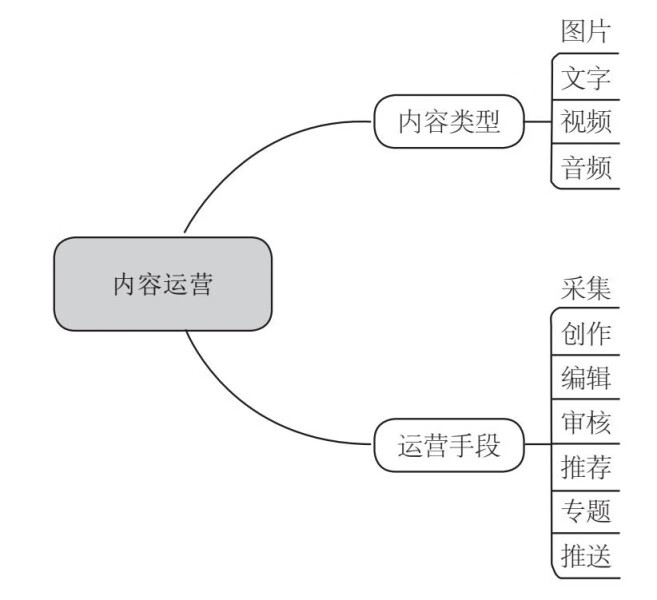

# 从零开始做运营

> 作者：张亮

[toc]

## 产品经理能力

-   知识结构
-   需求敏感性
-   需求转化的能力

## 产品的生命周期

-   孕育：产品设计的过程
-   初创：达到上线状态，与用户见面
-   成长：获取用户、持续运营
-   成熟：用户稳定、收入持续
-   衰退：用户衰减、收入减少
-   消亡：最后完成历史使命，产品终结

> 运营的核心任务：流量建设，用户运营

## 产品运营

### 内容运营

-   网站（产品）中可供用户消费并且**延长用户停留时间**、促进用户转化的展示均可称之为“内容”。

> 内容运营是指通过创造、编辑、组织、呈现网站或产品的内容，从而提高互联网产品的内容价值，制造出对用户的黏着、活跃产生一定的促进作用的内容。

图 1 内容运营的工作

> 用户运营的核心是开源（拉动新用户）、节流（防止用户流失与流失用户挽回）、维持（已有用户的留存）、刺激（促进用户活跃甚至向付费用户转化）。

### 内容运营

> 活动运营是通过开展独立活动、联合活动，拉动某一个或多个指标的短期提升的运营工作。

#### 策划活动内容

-   活动文案撰写
-   活动流程设计
-   活动规则制定
-   活动成本预估：是指了解拉动一个指标的单人成本
-   活动预期收益：用户活跃度、留存率等
-   活动效果统计：总结形成活动机制，持续贡献效益
-   活动改进措施

### 内容供应链

图 2 典型的网站内容流转流程图

-   网站（产品）上有哪些内容（定位）
-   这些内容从哪里来，由谁提供（来源）
-   这些内容要给谁看，要达到什么样的目标（受众）
-   这些内容要如何组织与呈现（展现机制）
-   这些内容如何筛选，什么是好的内容（内容标准化）

图 3 划分通知或者推送的渠道

## 用户研究
- 内容消费者是谁？
- 他们通常在什么地方活跃？
- 他们的习惯是怎么样的？
- 最近他们在关注什么热点？
- 我需要提供什么内容才能让他们注意到我、爱上我？