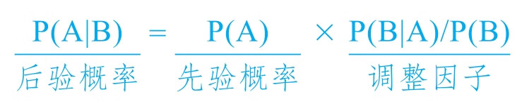

# 底层逻辑 2：理解商业世界的本质

[toc]

## 数学对商业的重要性

-   **▶ 四则运算**：基于数字的加减乘除在商业世界具有独特价值，掌握这个工具，你就能从数字中开采出“矿藏”。比如，用加减乘除来分析一家公司的财务报表，能使你如同透视一般了解其真实的经营情况。
-   **▶ 笛卡尔坐标系**：利用笛卡尔坐标系创建的重要思维工具——维度，养成“五维思考”的习惯，你就能升维思考、降维执行，从而更好地理解商业世界，在创业道路上所向披靡。
-   **▶ 指数和幂**：指数和幂以及它们背后的数学规律，几乎决定了你在商业世界里能获得多大的成功。理解了这两个数学概念，你就能看清这个“不平等”的世界的游戏规则，明白“多者更多，少者更少”才是世界的正常状态，从而选择适合你的赛道，在你的赛道里，做时间的朋友，收获属于你的成功。
-   **▶ 方差与标准差**：方差与标准差是衡量差异性的重要工具，掌握了这两个数学工具，你就懂得在经营企业、管理团队、制造产品时缩小该缩小的差异性，扩大该扩大的差异性，从而确保企业的良性运转。
-   **▶ 概率与统计**： 这个世界从来都是不确定的，创业就是管理概率。只有懂得概率和统计，理解了数学期望、大数定律和条件概率等数学概念，你才能理解世界的不确定性并且不焦虑，在看清创业的真相后依然热爱创业。
-   **▶ 博弈论**： 你在决策时，别人也在决策。这些决策相互影响，甚至相互交织，从而使那些奇妙的决策显得很愚蠢，使那些莫名其妙的决策产生奇效。而收益矩阵、占优策略、纳什均衡等博弈论概念能帮助你在复数主体下做出更好的战略决策，利用数学的力量让自己在商业世界中始终“占优”。

## 创业成功公式

> 整体成功率=100%-（100%-基础成功率）尝试次数

这个公式里只有两个变量：一是基础成功率，二是尝试次数。

## 销售万能公式

> 销售=流量 × 转化率 × 客单价 × 复购率

## ROI

> ROI：Return On Investment，即投资回报率
> ROI = 营收（收入）/ 预算（支出）

## 财务报表

> 财务报表：一般指的是资产负债表、利润表、现金流量表。

### 加法：资产负债表

-   固定资产：是指投资建的厂房、买的办公设备等。
-   存货：是指公司从上游进的原材料，以及加工完未销售的成品。
-   应收账款：是指公司应该收回却没有收回的款项。
-   预收账款：是指公司还没有交付产品或服务就向下游客户预收的款（本质是向客户“借款”）。
-   应付账款：是指公司拿了上游供应链的货，说打了个欠条，以后再付（本质是向供应商“借款”）。
-   借款：是指向亲戚朋友以及银行等金融机构借钱。

-   负债=预收账款+应付账款+借款
-   股东权益=自己权益+投资人权益

> 资产负债表（折叠版）：资产=负债+股东权益
> 资产负债表（展开版）：资产（现金+存货+应收账款+固定资产）=负债（预收账款+应付账款+借款）+股东权益（自己权益+投资人权益）

经营过程中两个循环：增值循环（现金 <=> 存货 <=> 应收账款）、贬值循环(固定资产)
=> **所谓经营：就是有策略地把资产分配在现金、存货、应收账款、固定资产者四个展开项上，让它们彼此之间进行最有效的配合，使增值循环远远大于贬值循环，从而赚钱。差值越大，循环越快，越赚钱**

#### 如何看资产负债表

> ▶ 先看看向 3 个债主借了多少钱，在看看向 2 个股东融了多少钱，再看看这些钱在 4 个资产篮子里的分配策略是否高效

### 减法：利润表

> 看利润表的第一个核心目的是看 毛利（率），判断自己的市场竞争水平，再看看净利（率），判断自己的管理效率水平

-   收入 - 直接成本 = 毛利
-   收入 - 直接成本 - 间接费用（例如办公室租赁费、管理层工资、银行利息、税费等） = 净利
-   毛利率 = 毛利 / 营业收入 x 100 %
-   净利率 = 净利 / 营业收入 x 100 %

### 乘法：净资产收益率

> 净资产收益率：Return On Equity（ROE）
> 净资产收益率= 净利润 / 净资产 x 100% = 净利润 / 销售收入 x 销售收入 / 总资产 x 总资产 / 净资产 x 100%

-   销售净利润 = 净利润 / 销售收入
-   资产周转率 = 销售收入 / 总资产
-   权益乘数 = 总资产 / 净资产

### 除法：运营能力、偿债能力与盈利能力

> 除法是用来给企业做“体检”的重要办法

-   运营能力 对应 资产负债表里的 资产
-   偿债能力 对应 资产负债表里的 负债
-   盈利能力 对应 资产负债表里的 股东权益

#### 运营能力

衡量存货周转快慢，从财务报表里：第一个指标，存货平均余额，表示公司仓库里的货占用了多少资金；第二个指标，销售成本（不算利润的货值）

-   存货周转次数 = 销售成本 / 存货 平均余额
-   应收账款周转次数 = 销售收润 / 应收账款 平均余额
-   流动资产周转次数 = 销售成本 / 流动资产 平均余额
-   总资产 周转次数 = 销售成本 / 总资产 平均余额

#### 偿债能力

-   现金比率= 现金 / 流动负债（预收账款，应付账款，借款等随时产生，随时归还的债务）。现金比率越高，说明还债能力越强
-   速动比率= (现金 + 应收账款) / 流动负债。如果要抵押应收账款还债，说明公司的“速动比率”不错
-   流动比率= (现金 + 应收账款 + 存货) / 流动负债。如果必须甩卖存货还债，说明公司的“流动比率”够用

#### 盈利能力

> 净资产收益率是衡量盈利能力的“全能公式”

-   净资产收益率=净利润/净资产平均余额
-   总资产收益率=净利润/总资产平均余额
-   每股收益=净利润/股数
-   市盈率=每股市价/每股收益

用加减乘除分析财务报表，如下图所示

零维到五维思考模式，如下图所示

### 建议

-   找到投资人，跨越奇点，才能获得指数增长
-   寻找有指数增长特征的行业
    小麦棋盘公式里的“增长因子”：后一年=前一年 x (1+20%)

## 概率

### 数学期望、大数定律、 条件概率

### 投资人的统计游戏

-   天使轮投资：排除产品风险
-   A 轮投资：排除收入风险
    收入模型：明确谁会购买你的产品，为什么而付钱，付多少钱，有多少人付钱。
-   B 轮融资：排除盈利风险。
    盈利模式：有收入不代表会有盈利，在这一步，需要掌握一些核心资源，控制成本结构，理顺关键流程，建立围绕核心业务的支持系统，验证自己的商业模式。
-   C 轮融资：排除运营风险。
-   D 轮投资：大多是为上市做准备的投资银行等机构

### 贝叶斯公式

#### 举个例子

很多公司都特别关注用户的购买转化率。所谓购买转化率，指的是假如有 100 个用户看到商品详情页，有多少用户会下单购买。购买转化率是一种概率，我们称之为 P（A），其中，“A”指的是购买。我们现在假设，你公司当前的购买转化率是已知的——100 个用户看到商品详情页，有 2 个用户会买，P（A）=2%。因为 P（A）是已知的，所以叫先验概率。

某一天，员工甲突然提议：“我们要不要把商品详情页的头图都换成国风的啊？我们用过几次国风头图，感觉效果很好呢。现在年轻人喜欢国风，我们多用国风头图，购买转化率可能会上升呢。”

那么，问题来了：把头图换成国风的，有助于提升购买转化率吗？

用国风头图，就是动作“B”，而基于国风头图的购买转化率，我们用“P（A|B）”表示。那么，P（A|B）是否大于原来的转化率呢？

首先，你要算一下 P（B|A）。A 是购买，B 是用国风头图，所以，P（B|A）的意思就是在所有购买订单中，有多少单的商品详情页用了国风头图。运营经理立刻到后台查了一下，发现在上个月的 800 个订单中，有 450 单商品详情页用了国风头图，所以，P（B|A）=450/800=56.25%。

然后，你还要算一下 P（B）。B 是用国风头图，所以，P（B）指的是在所有向用户展示过的商品详情页中，有多少用的是国风头图，也就是国风头图的使用率。运营经理又到后台查了一下，发现上个月用户一共点击了 4 万次商品详情页，其中有 1 万次用的是国风头图。所以，P（B）=1 万/4 万=25%。

再来计算调整因子。调整因子指的是动作 B（用国风头图）对结果 A（购买）的影响，其计算方法为：P（B|A）/P（B）。将这个案例中的调整因子带入计算可得：

P（B|A）/P（B）=56.25%/25%=2.25

所以，用国风头图对用户购买的影响是 2.25。

现在，我们完整带入贝叶斯公式：

P（A|B）=P（A）×P（B|A）/P（B）=2%×2.25=4.5%

也就是说，如果把所有头图都换为国风头图，你公司产品的购买转化率会从 2%陡升到 4.5%。

> 真正的高手每天都在用贝叶斯定理不断复盘、改进自己的流程，从而总结出那些“大概率会带来成功的事情”，

## 博弈论

### 收益矩阵

> 收益矩阵有很多名字，比如支付矩阵、报酬矩阵、赢得矩阵、得益矩阵，但无论叫哪一个名字，其中都有“矩阵”二字。因为一旦决策者从单人变为至少双人，决策就从一维的得失问题变为二维的利害关系问题了。

### 占优策略

> 占优策略，又称优势策略、支配性策略，它指的是这样一种策略：如果你采取行动，我会占据优势；如果你不采取行动，我也会占据优势。无论如何，两次我都能占据优势。

### 纳什均衡

> 什么是“纳什均衡”？简单来说，纳什均衡就是一种博弈的“稳定结果”，谁单方面改变策略，谁就会受到损失。

### 经典博弈中的决策智慧

#### 智猪博弈：“搭便车”策略

对小公司来说，等大公司教育好市场后“搭便车”是最佳策略；而对大公司来说，在一个小公司都想搭便车的领域里，只好选择“还是我来吧”。

#### 胆小鬼博弈：怎么才能让对方相信我比他先疯

#### 金秋游戏：承诺、新人以及贪婪的终极考验
