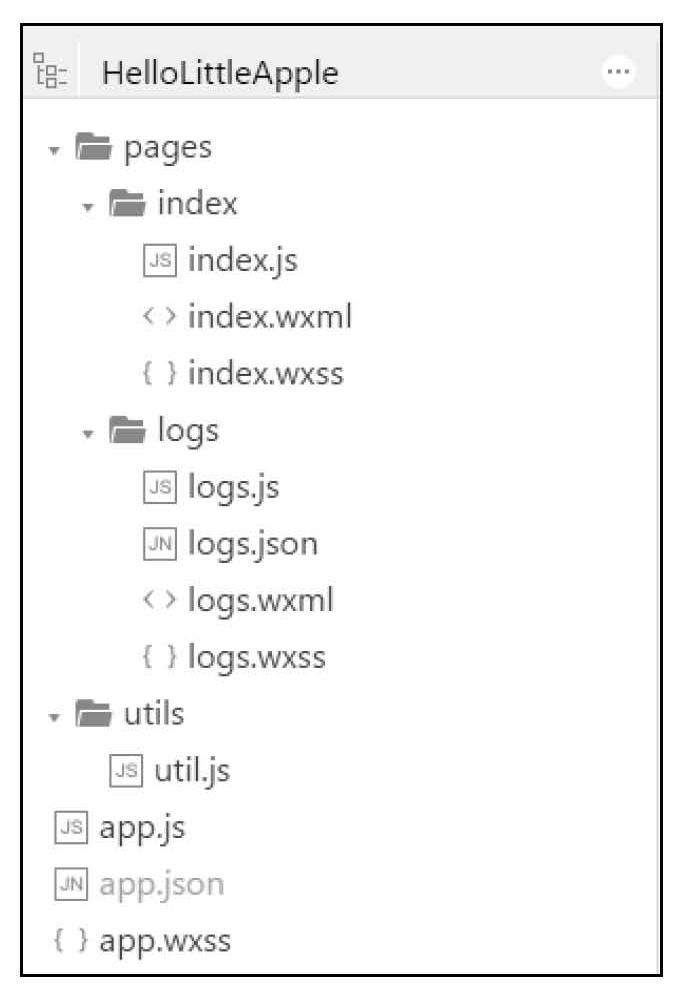
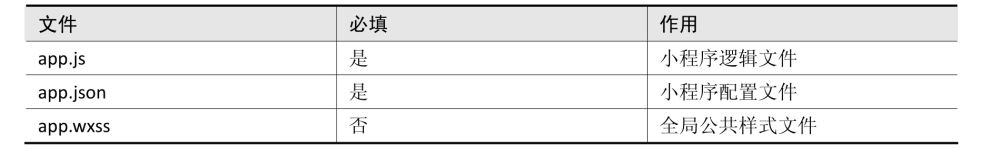
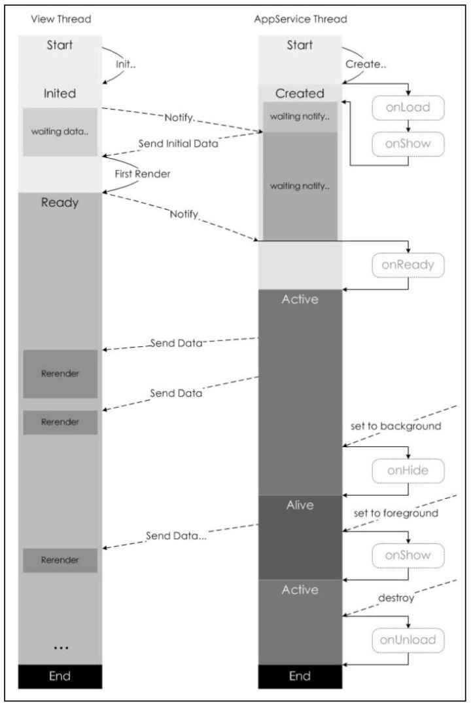
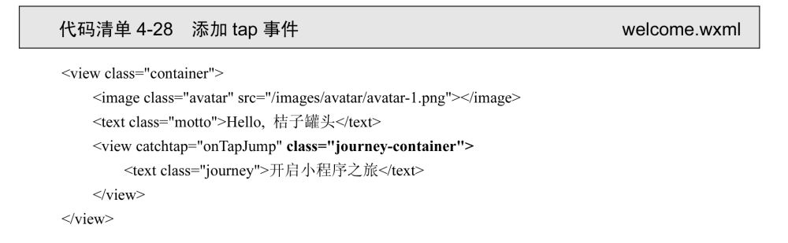
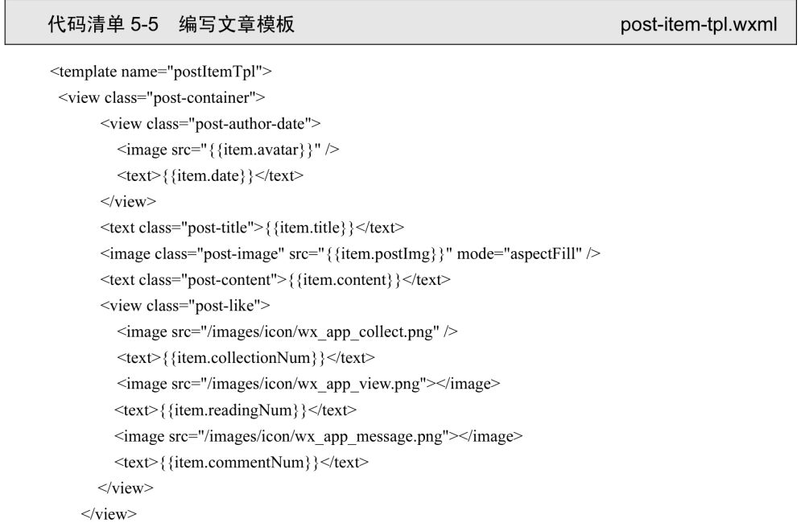
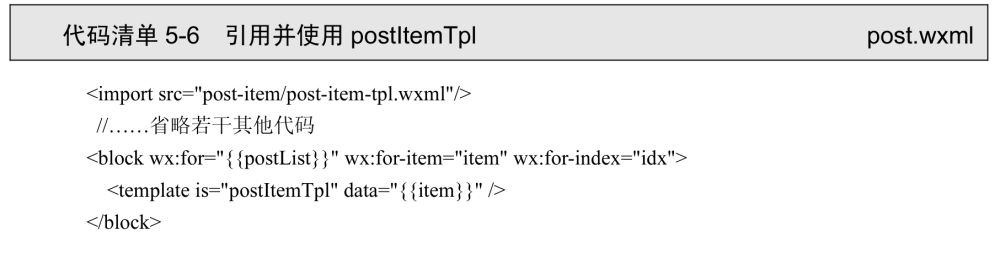
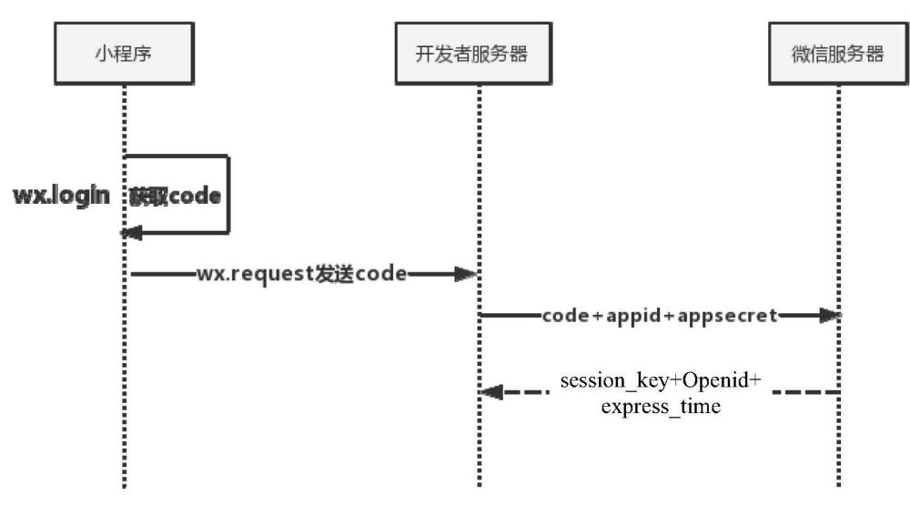
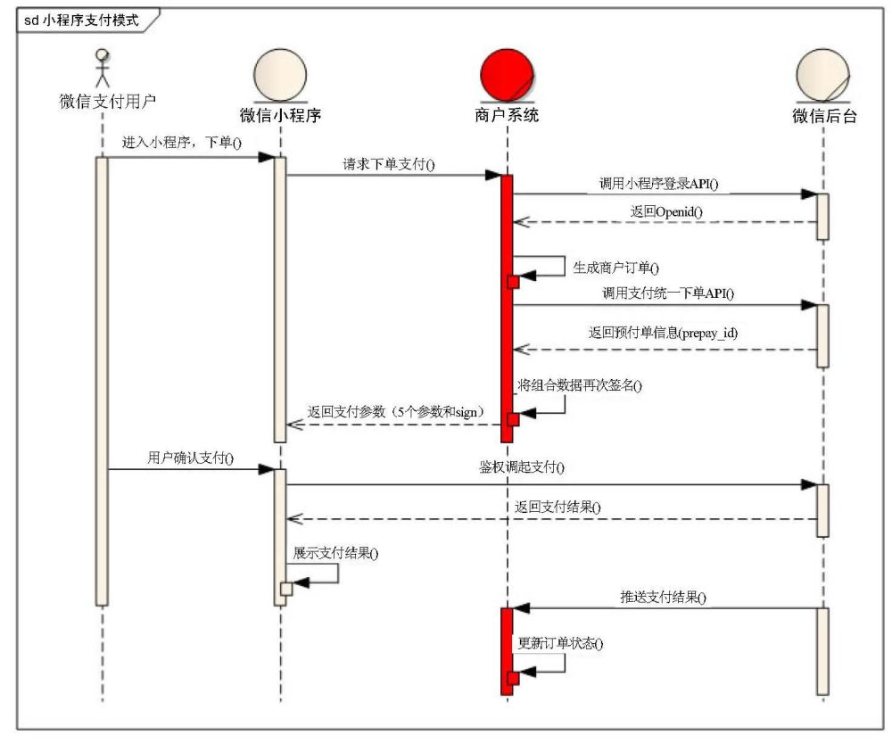

# 微信小程序开发入门与实践

> 作者：雷磊

[toc]

## App 主流开发方式

-   Web App：加入了响应式的设计让它适合在移动端显示和运行，所采用的技术依然是 JavaScript、CSS 和 HTML。
-   Native App：iOS 和 Android
-   Hybrid App：Web App 与 Native App 的混合体，拥有一部分访问原生组件（相机、加速器）的能力。

## 项目目录说明

### 项目文件结构

图 1 官方示例项目的文件及文件结构

### 应用程序级别的文件

图 2 app.js、app.json和 app.wxss的含义

### pages

> pages 文件夹下就有 2 个页面，分别是 index 页面和 logs 页面。每个页面可以由 4 个文件构成，分别是：.js、.wxml、.wxss 和.json 文件。

-   wxml：小程序自己封装的一些组件。
-   wxss：编写小程序的样式。
-   json：配置页面的样式与行为。
-   js：编写小程序的页面逻辑。

> 建议以 iPhone 6 的宽度 750 个物理像素作为标准，来做设计图。在此宽度下，这张设计图里每个元素的尺寸转换到小程序样式时，转换比例为 1 物理像素=1rpx=0.5px。rpx 和 px 就是小程序样式里可以使用的两种长度单位。

## MINA 框架

### 页面的生命周期

-   加载：onLoad 监听页面加载，一个页面只会调用一次。
-   显示：onShow 监听页面显示，每次打开页面都会调用。
-   渲染：onReady 监听页面初次渲染完成，一个页面只会调用一次，代表页面已经准备妥当，可以和视图层进行交互。
-   隐藏：onHide 监听页面隐藏。
-   卸载：onUnload 监听页面卸载。

图 3 页面生命周期图解

### RESTful API

> ‌RESTful API‌ 是一种基于 REST（Representational State Transfer）架构风格设计的 Web API 接口。它使用 HTTP 协议中的方法（如 GET、POST、PUT、DELETE）来操作资源，并遵循一系列约定，使得接口具有一致性、简洁性和可扩展性。

统一接口 ‌：使用统一的 HTTP 方法操作资源：GET 用于获取资源，POST 用于创建资源，PUT 用于更新资源，DELETE 用于删除资源。避免在接口中出现额外的动词（如/getUser 应改为/users/{id}）‌

### 事件

图 4 添加 tap 事件

catchtap="onTapJump" 时间绑定

#### 页面跳转

-   wx.redirectTo：将都关闭当前页面，跳转到指定页面。
-   wx.navigateTo：将保留当前页面，跳转到指定页面。
-   wx.switchTap：只能用于跳转到带 tabbar 的页面，并关闭其他所有非 tabbar 页面。

### 模板 template

图 5 编写文章模板

图 6 引用应使用 postItemTpl

### tab 选项卡

-   iconPath/selectedIconPath tab 选项卡上的图片路径，图片大小限制为最大 40KB，建议尺寸为 81px × 81px。

### 实现页面下拉刷新“三步曲”

-   在页面的 json 文件中配置 enablePullDownRefresh 选项，打开下拉刷新开关。
-   在页面的 js 文件中编写 onPullDownRefresh 函数，完成自己的下拉刷新逻辑。
-   编写完下拉刷新逻辑代码后，主动调用 wx.stopPullDownRefresh 函数停止当前页面的下拉刷新。

## 用户登录

图 7 登录并获取 session_key 和 openId 的流程图

## 微信小程序支付流程

图 8 微信小程序支付流程图

