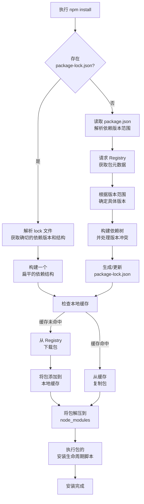

# npm

## 🌟 npm 的核心优点

npm 作为 Node.js 的默认包管理器，其优点可以概括为以下几个方面 ：

| 优点维度             | 具体描述                                                                                       | 带来的价值                                                                                        |
| :------------------- | :--------------------------------------------------------------------------------------------- | :------------------------------------------------------------------------------------------------ |
| **庞大的生态系统**   | npm 拥有世界上最大的开源代码库，超过百万个可重用的软件包 。                                    | 开发者无需“重新发明轮子”，可以站在巨人的肩膀上，利用现有模块快速构建应用，极大提升开发效率 。     |
| **出色的依赖管理**   | 通过 `package.json` 和 `package-lock.json` 文件，npm 能精确记录和管理项目的所有依赖及其版本 。 | 确保了项目在不同环境下（如开发、测试、生产）依赖的一致性，有效避免了“在我电脑上能跑”的尴尬问题 。 |
| **活跃的社区支持**   | 作为官方工具，npm 拥有最广泛的用户群和社区支持 。                                              | 遇到问题容易找到解决方案，丰富的文档和示例也降低了学习和开发的门槛 。                             |
| **内置安全机制**     | 提供 `npm audit` 命令，可以扫描项目依赖中的已知安全漏洞，并尝试自动修复 。                     | 帮助开发团队及时发现和修复安全问题，提升应用的整体安全性 。                                       |
| **强大的自动化能力** | 支持在 `package.json` 中定义 `scripts`（脚本），用于自动化执行测试、构建、部署等重复性任务 。  | 简化了开发工作流，是实现持续集成和持续交付（CI/CD）的基础 。                                      |

### ⚙️ npm install 的安装机制

当你运行 `npm install` 时，背后其实执行了一系列复杂的操作。整个流程可以理解为以下几个关键步骤：

#### 1. 依赖解析

- **读取清单**：首先，npm 会读取项目根目录下的 `package.json` 文件，获取其中列出的直接依赖项及其允许的版本范围（例如 `^18.2.0` 表示允许安装不改变大版本的更新）。
- **构建理想依赖树**：npm 需要根据这些版本范围，并结合每个依赖包自身的 `package.json` 中的子依赖，构建出一个完整的、理想的依赖树。这个过程需要解决复杂的版本冲突问题 。

#### 2. 获取包信息与版本锁定

- **查询 Registry**：npm 会向配置的 registry（默认是 `https://registry.npmjs.org/`）发送请求，获取每个包的所有版本元数据 。
- **检查 Lock 文件**：此时，`package-lock.json` 文件开始发挥关键作用。如果存在该文件，npm 会优先使用其中记录的**确切版本**和**依赖结构**，而不是重新解析 `package.json` 中的版本范围。这确保了团队成员或 CI 环境能安装到完全一致的依赖 。

#### 3. 扁平化 node_modules

- **处理冲突**：在早期版本中，npm 使用嵌套的依赖树，导致路径过长和大量重复。现在，npm 在安装时会尽可能地将所有依赖包**扁平化**地提升到顶层的 `node_modules` 文件夹下 。
- **解决重复**：当不同的包依赖同一个库的**不同版本**时，npm 会尽力进行协调。如果版本差异无法调和，才会将其中一个版本仍然以嵌套的形式安装在其父包自己的 `node_modules` 下 。

#### 4. 缓存与下载

- **检查缓存**：在决定下载一个包之前，npm 会先检查本地缓存（`~/.npm`）。如果包已经在缓存中且未过期，则直接使用缓存，实现“离线安装”，速度极快 。
- **下载与缓存**：如果缓存未命中，npm 会从 registry 下载包的 tarball（压缩文件），并将其解压到项目的 `node_modules` 中，同时将包添加到本地缓存，以备下次使用 。

#### 5. 执行生命周期脚本

- 如果安装的包中定义了 `install`、`preinstall`、`postinstall` 等脚本，npm 会在相应的时机执行它们 。

### 💡 背后的设计思想

npm 的设计并非凭空而来，它背后的思想深刻地影响了整个 JavaScript 生态。

- **语义化版本控制**：这是 npm 依赖管理的基石 。它通过 `^`、`~` 等符号，让开发者既能自动获取 bug 修复（补丁版本），又能保证大版本升级不会自动发生，从而在**项目稳定性和依赖更新之间取得平衡** 。
- **依赖即代码**：npm 倡导将依赖的代码（`node_modules`）视为项目的一部分（即使不提交到代码库），并通过 `package.json` 和 `package-lock.json` 文件**精确描述和锁定环境**。这种思想保证了环境的一致性和可重复性，是现代化软件开发流程（如 CI/CD）的基础 。
- **模块化与复用**：npm 的整个设计都是为了鼓励**小而美的模块**。开发者可以轻松地创建、发布和复用小块的、功能单一的代码块，共同构建出复杂而强大的应用。这不仅是技术，也是一种文化和哲学 。
- **约定优于配置**：npm 提供了合理的默认值，比如 `dependencies` 和 `devDependencies` 的区分、`scripts` 的使用等。这些约定简化了开发者的决策过程，让大家遵循统一的标准，使得项目更容易被理解和维护 。

希望这个梳理能帮助你更好地理解 npm。在实际开发中，你是更倾向于使用 npm 自带的命令，还是已经切换到 yarn 或 pnpm 了呢？我们可以接着聊聊它们之间的差异。
