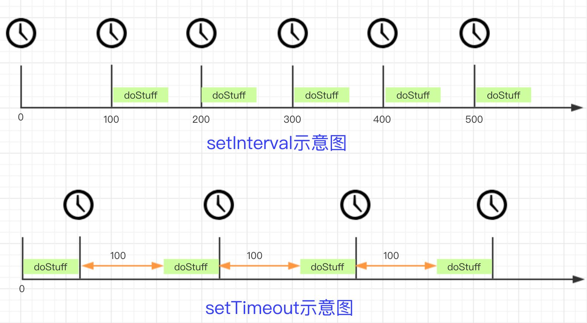
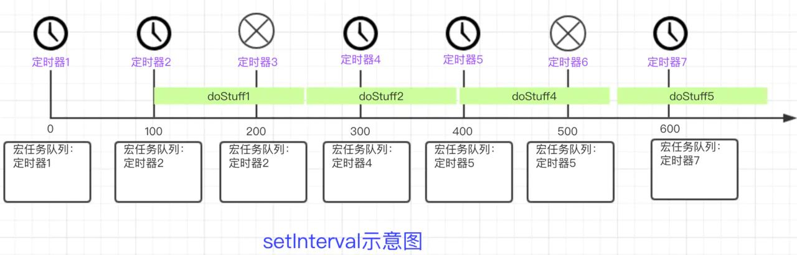

# setTimeout & setInterval

> setTimeout: 在指定的毫秒数后执行指定代码(只执行一次)
> setInterval: 间隔指定的毫秒数不停地执行指定的代码（一直执行）

```JavaScript
function doStuff(){
    // 此处为需要执行一段时间为 T 的代码
}

setInterval(doStuff, 100)

function tick(){
    doStuff()
    setTimeout(tick, 100)
}

tick()
```

## 解析图（图片来源于网络）



> setInterval 每个定时器之间的间隔是 100ms。而 setTimeout 每隔 100ms 执行一次 doStuff，所以每隔定时器之间的间隔是 100 + T (T 为 doStuff 的执行时间)

- **如果 T 可以忽略的话，两者的效果是基本相同的**
- **T <= 100 时，setInterval 定时器的间隔是 100， setTimeout 定时器的间隔是 100 + T**
- 如果 T > 100, setTimeout 的时间间隔依然是 100 + T,
  setInterval 的时间间隔为：第一次执行时间间隔为 100 ，后续的执行时间间隔为 T



```JavaScript
let i = 0;
console.time("总时间");

function doStuff() {
    console.log("start doStuff");
    delay(140);
    console.timeEnd("end doStuff");
}

function delay(time) {
    var start = new Date().getTime();
    while (new Date().getTime() < start + time);
}

let timer = setInterval(() => {
    i++;

    if (i > 4) {
        clearInterval(timer);
        setTimeout(() => {
            console.timeEnd("总时间");
        }, 0);
    }

    console.log("interval start");
    console.time("测试");
    doStuff();
}, 100);

// 总时间: 816.165ms = 100 + 5 * 140
```

```JavaScript
let i = 0;
console.time("总时间");

function delay(i) {
    promise(i);
}

function promise(i) {
    return new Promise((resole,reject) => {
        setTimeout(() => {
            resole(i);
        }, 140);
    }).then(res => {
        console.log("res", res);
    })
}

let timer = setInterval(() => {
    i++;
    if (i > 4) {
        clearInterval(timer);
        setTimeout(() => {
            console.timeEnd("总时间");
        }, 0);
    }
    delay(i);
}, 100);

// 总时间 500 ms = 100 * 5

```

## 总结

- <code>setInterval</code> 只是在特定时间点将代码推入队列，如果已有定时器在队列中，则会跳过。**浏览器不会同时创建两个相同的间隔计时器**
- <code>setInterval</code> 设置定时时间小于函数体内的执行时间时候，则**第一次执行定时时间后面的真正的定时时间应该是执行函数体的总时间**
- <code>setInterval</code> 中的异步代码不会阻塞创建新的定时器
