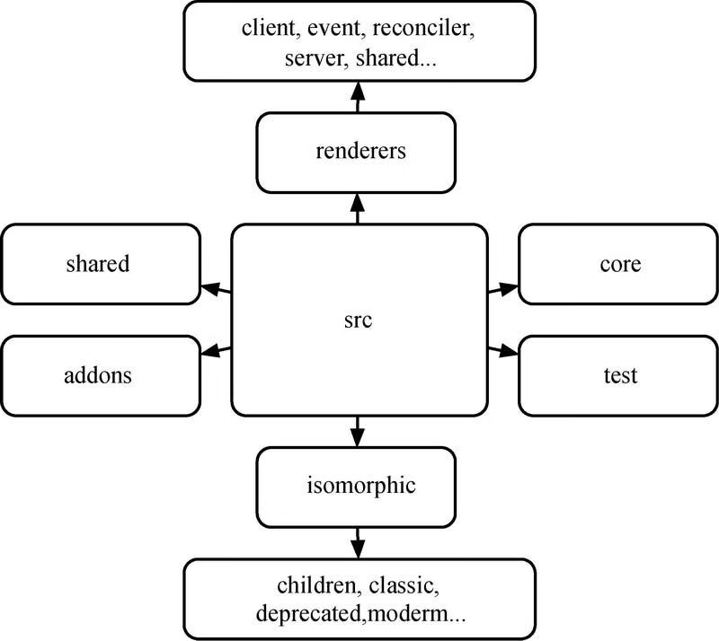
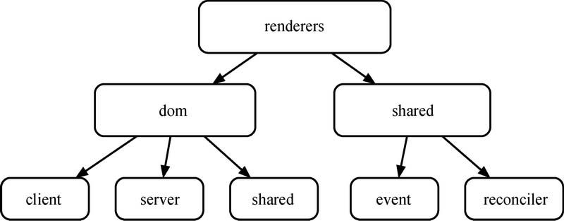
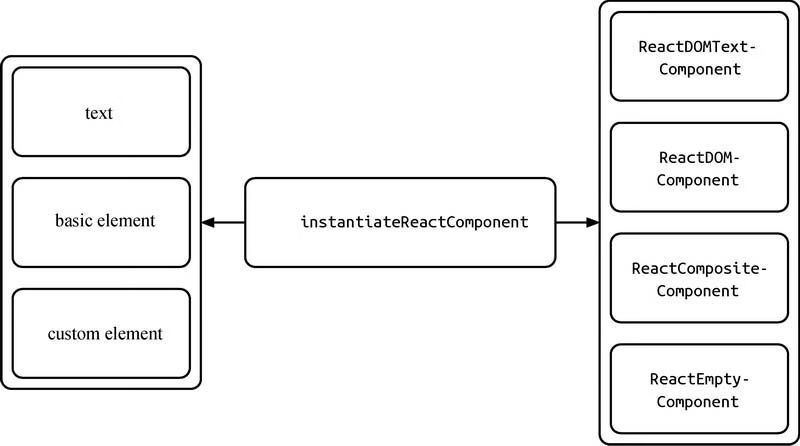
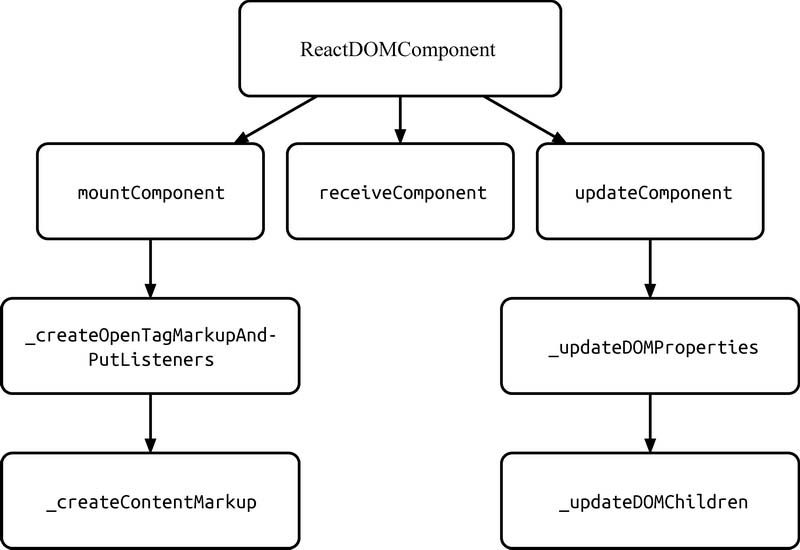
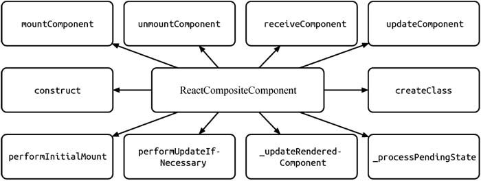
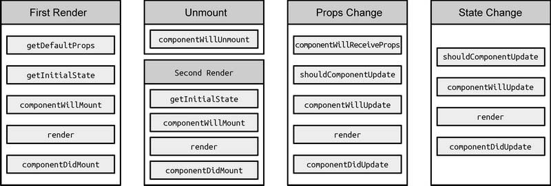
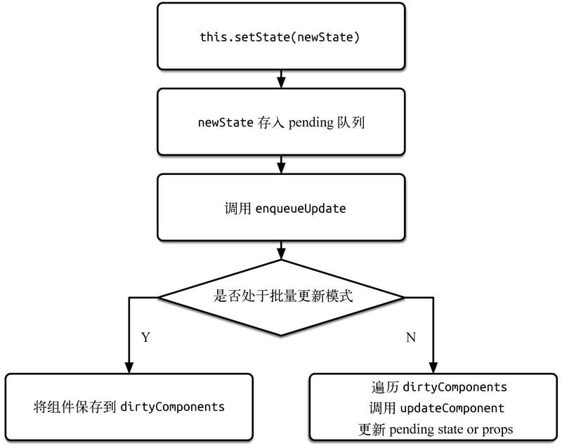
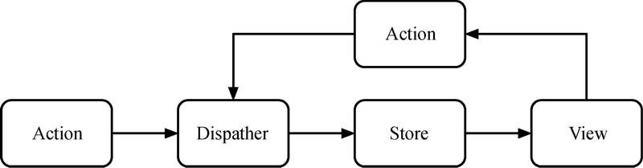

# React15.x

> React 的主要思想是通过构建可复用组件来构建用户界面。

[toc]

## 源码的组织结构


<p style="color:#00adb5;text-align:center;">图 1 React15.x 源码目录</p>

-   addons：包含一系列的工具方法插件，如 PureRenderMixin、CSSTransitionGroup、Fragment、LinkedStateMixin 等。
-   isomorphic：包含一系列同构方法。
-   shared：包含一些公用或常用方法，如 Transaction、CallbackQueue 等。
-   test：包含一些测试方法等。
-   core/tests：包含一些边界错误的测试用例。
-   renderers：是 React 代码的核心部分，它包含了大部分功能实现，此处对其进行单独分析。
-   dom：包含 client、 server 和 shared。
-   client：包含 DOM 操作方法（如 findDOMNode、setInnerHTML、setTextContent 等）以及事件方法。这里的事件方法主要是一些非底层的实用性事件方法，如事件监听（ReactEventListener）、常用事件方法（TapEventPlugin、EnterLeaveEventPlugin）以及一些合成事件（SyntheticEvents 等）。


<p style="color:#00adb5;text-align:center;">图 2 React15.x 下 renderers 源码目录</p>

-   dom/server：主要包含服务端渲染的实现和方法（如 ReactServerRendering、ReactServerRenderingTransaction 等）。
-   dom/shared：包含文本组件（ReactDOMTextComponent）、标签组件（ReactDOMComponent）、DOM 属性操作（DOMProperty、DOMPropertyOperations）、CSS 属性操作（CSSProperty、CSSPropertyOperations）等。
-   shared：包含 event 和 reconciler。
-   event：包含一些更为底层的事件方法，如事件插件中心（EventPluginHub）、事件注册（EventPluginRegistry）、事件传播（EventPropagators）以及一些事件通用方法。

## reconciler

> reconciler 称为协调器，它是最为核心的部分，包含 React 中自定义组件的实现（ReactCompositeComponent）、组件生命周期机制、setState 机制（ReactUpdates、ReactUpdateQueue）、DOM diff 算法（ReactMultiChild）等重要的特性方法。

### Virtual Dom

Virtual Dom 模型，只需要具备一个 DOM 标签所需的基本元素即可：

-   标签名
-   节点属性，包含样式、属性、事件等
-   子节点
-   标识 id

```Javascript
{
    tagName: 'div',
    properties: {
        style: {}
    },
    children: [],
    key: 1
}
```

Virtual Dom 又被称为 ReactNode，分为三种类型：

-   ReactElement
    -   ReactComponentElement
    -   ReactDOMElement
-   ReactFragment
-   ReactText

#### 初始化组件入口

-   首先调用 instantiateReactComponent，初始化组件的入口函数，通过判断 node 类型区分不同组件的入口


<p style="color:#00adb5;text-align:center;">图 4 instantiateReactComponent 函数关系 </p>

-   当 node 为空时，说明 node 不存在，则初始化空组件 ReactEmptyComponent.create(instantiateReactComponent)。
-   当 node 类型为对象时，即是 DOM 标签组件或自定义组件，那么如果 element 类型为字符串时，则初始化 DOM 标签组件 ReactNativeComponent.createInternalComponent(element)，否则初始化自定义组件 ReactCompositeComponentWrapper()。
-   当 node 类型为字符串或数字时，则初始化文本组件 ReactNativeComponent.createInstanceForText(node)。
-   如果是其他情况，则不作处理。

##### 文本组件

当 node 类型为文本节点时是不算 Virtual DOM 元素的，但 React 为了保持渲染的一致性，将其封装为文本组件 ReactDOMTextComponent。

##### DOM 标签组件

ReactDOMComponent 针对 Virtual DOM 标签的处理主要分为以下两个部分：

-   属性的更新，包括更新样式、更新属性、处理事件等；
-   子节点的更新，包括更新内容、更新子节点，此部分涉及 diff 算法。


<p style="color:#00adb5;text-align:center;">图 5 ReactDOMComponent 关系 </p>

当执行 receiveComponent 方法时，ReactDOMComponent 会通过 this.updateComponent(transaction, prevElement, nextElement, context) 来更新 DOM 节点属性。

先是**删除不需要的子节点和内容**。如果旧节点存在，而新节点不存在，说明当前节点在更新后被删除，此时执行方法 this.updateChildren(null, transaction, context)；如果旧的内容存在，而新的内容不存在，说明当前内容在更新后被删除，此时执行方法 this.updateTextContent('')。

再是**更新的子节点和内容**。如果新子节点存在，则更新其子节点，此时执行方法 this.updateChildren(nextChildren, transaction, context)；如果新的内容存在，则更新内容，此时执行方法 this.updateTextContent('' + nextContent)。

##### 自定义组件

ReactCompositeComponent 自定义组件实现了一整套 React 生命周期和 setState 机制，因此自定义组件是在生命周期的环境中进行更新属性、内容和子节点的操作。这些更新操作与 ReactDOMComponent 的操作类似。


<p style="color:#00adb5;text-align:center;">图 6 ReactCompositeComponent 关系 </p>

## React 生命周期

组件的生命周期再不同状态下的执行顺序：

-   当首次挂载组件时，按顺序执行 getDefaultProps、getInitialState、componentWillMount、render 和 componentDidMount。
-   当卸载组件时，执行 componentWillUnmount。
-   当重新挂载组件时，此时按顺序执行 getInitialState、componentWillMount、render 和 componentDidMount，但并不执行 getDefaultProps。
-   当再次渲染组件时，组件接受到更新状态，此时按顺序执行 componentWillReceiveProps、shouldComponentUpdate、componentWillUpdate、render 和 componentDidUpdate。


<p style="color:#00adb5;text-align:center;">图 7 生命周期的执行顺序 </p>

### 使用 createClass 创建自定义组件

当使用 ES6 classes 编写 React 组件时，class MyComponent extends React.Component 其实就是调用内部方法 createClass 创建组件。

```Javascript
var ReactClass = {
    // 创建自定义组件
    createClass: function(spec) {
        var Constructor = function(props, context, updater){
            // 自动绑定
            if(this.__reactAUtoBindParis.length){
                bindAutoBindMethods(this);
            }

            this.props = props;
            this.context = context;
            this.refs = emptyObject;
            this.updater = updater || ReactNoopUpdateQueue;
            this.state = null;

            // ReactClass 没有构造函数，通过 getInitialState 和 componentWillMount 来代替
            var initialState = this.getInitialState ? this.getInitialState() : null;
            this.state = initialState;
        }

        // 原型继承父类
        Constructor.prototype = new ReactClassComponent();
        Constructor.prototype.constructor = Constructor;
        Constructor.prototype.__reactAutoBindPairs = [];

        // 合并 mixin
        injectedMixins.forEach(
            mixSpecIntoComponent.bind(null, Constructor)
        );

        mixSpecIntoComponent(Constructor, spec);

        // 所有 mixin He病后初始化 defaultProps(在整个生命周期中，getDefaultProps 只执行一次)
        if(Constructor.getDefaultProps){
            Constructor.defaultProps = Constructor.getDefaultProps();
        }

        // 减少查找并设置原型的时间
        for(var methodName in ReactClassInterface){
            if(!Constructor.prototype[methodName]){
                Constructor.prototype[methodName] = null;
            }
        }

        return Constructor;
    }
}

```

### MOUNTING

通过 mountComponent 挂载组件，初始化序号、标记等参数，判断是否为无状态组件，并进行对应的组件初始化工作，比如初始化 props、context 等参数。利用 getInitialState 获取初始化 state、初始化更新队列和更新状态。

若存在 componentWillMount，则执行。**如果此时在 componentWillMount 中调用 setState 方法，是不会触发 re-render 的，而是会进行 state 合并**，且 inst.state = this.\_processPendingState (inst.props, inst.context) 是在 componentWillMount 之后执行的，因此 **componentWillMount 中的 this.state 并不是最新的，在 render 中才可以获取更新后的 this.state**。

因此，React 是利用更新队列 this.\_pendingStateQueue 以及更新状态 this.\_pendingReplaceState 和 this.\_pendingForceUpdate 来实现 setState 的异步更新机制。

当渲染完成后，若存在 componentDidMount，则调用。这就解释了 componentWillMount、render、componentDidMount 这三者之间的执行顺序。

其实，mountComponent 本质上是通过渲染内容的，由于递归的特性，父组件的 componentWillMount 在其子组件的 componentWillMount 之前调用，而父组件的 componentDidMount 在其子组件的 componentDidMount 之后调用。

> 禁止在 shouldComponentUpdate 和 componentWillUpdate 中调用 setState，这会造成循环调用，直至耗光浏览器内存后崩溃。

## setState 异步更新

setState 通过一个队列机制实现 state 更新。当执行 setState 时，会将需要更新的 state 合并后放入状态队列，而不会立刻更新 this.state，队列机制可以高效地批量更新 state。

当调用 setState 时，实际上会执行 enqueueSetState 方法，并对 partialState 以及\_pendingStateQueue 更新队列进行合并操作，最终通过 enqueueUpdate 执行 state 更新。

而 performUpdateIfNecessary 方法会获取 \_pendingElement、\_pendingStateQueue、\_pendingForceUpdate，并调用 receiveComponent 和 updateComponent 方法进行组件更新。

如果在 shouldComponentUpdate 或 componentWillUpdate 方法中调用 setState，此时 this.\_pendingStateQueue != null，则 performUpdateIfNecessary 方法就会调用 updateComponent 方法进行组件更新，但 updateComponent 方法又会调用 shouldComponentUpdate 和 componentWillUpdate 方法，因此造成循环调用，使得浏览器内存占满后崩溃，如图 3-14 所示。

### setState 简化调用栈


<p style="color:#00adb5;text-align:center;">图 8 setState 简化调用栈 </p>

## diff 算法

### diff 策略

-   ·策略一：Web UI 中 DOM 节点跨层级的移动操作特别少，可以忽略不计。
-   ·策略二：拥有相同类的两个组件将会生成相似的树形结构，拥有不同类的两个组件将会生成不同的树形结构。
-   ·策略三：对于同一层级的一组子节点，它们可以通过唯一 id 进行区分。

### tree diff

基于策略一，React 对树的算法进行了简洁明了的优化，即对树进行分层比较，两棵树只会对同一层次的节点进行比较。

既然 DOM 节点跨层级的移动操作少到可以忽略不计，针对这一现象，React 通过 updateDepth 对 Virtual DOM 树进行层级控制，只会对相同层级的 DOM 节点进行比较，即同一个父节点下的所有子节点。当发现节点已经不存在时，则该节点及其子节点会被完全删除掉，不会用于进一步的比较。这样只需要对树进行一次遍历，便能完成整个 DOM 树的比较。

### component diff

-   ·如果是同一类型的组件，按照原策略继续比较 Virtual DOM 树即可。
-   ·如果不是，则将该组件判断为 dirty component，从而替换整个组件下的所有子节点。
-   ·对于同一类型的组件，有可能其 Virtual DOM 没有任何变化，如果能够确切知道这点，那么就可以节省大量的 diff 运算时间。因此，React 允许用户通过 shouldComponentUpdate() 来判断该组件是否需要进行 diff 算法分析。

### element diff

当节点处于同一层级时，diff 提供了 3 种节点操作，分别为 INSERT_MARKUP（插入）、MOVE_EXISTING（移动）和 REMOVE_NODE（删除）。

-   INSERT_MARKUP：新的组件类型不在旧集合里，即全新的节点，需要对新节点执行插入操作。
-   MOVE_EXISTING：旧集合中有新组件类型，且 element 是可更新的类型，generateComponentChildren 已调用 receiveComponent，这种情况下 prevChild=nextChild，就需要做移动操作，可以复用以前的 DOM 节点。
-   REMOVE_NODE：旧组件类型，在新集合里也有，但对应的 element 不同则不能直接复用和更新，需要执行删除操作，或者旧组件不在新集合里的，也需要执行删除操作。

## Flux

> Flux 核心思想局势**数据和逻辑永远单向流动**



<p style="color:#00adb5;text-align:center;">图 9 Flux 模型 </p>
