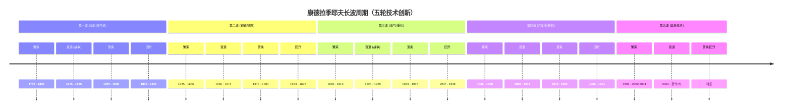

人生过于虚无，以至其本身是无法被直接“审视”的。

研究人生需要一个抓手。每个人的“道”都会有一条主线索，这就是那个抓手。

---
创业与投资中赌性和概率的问题

1. 成功的幅度往往比频次更重要；
2. 追求成功不意味着单纯追求高风险，而是要追求高期望价值；
3. 要想得到高期望价值，除了选择大收益的方向，还要不断锻炼自身，
努力提高实现理想结果的概率；
4. 概率再高也不是必然事件，所以要给自己预留充足的子弹，尝试足够
多的机会。

---

马太效应：强者愈强、弱者愈弱；优势不断累积，差距持续拉大的正向循环分化现象。

匹配的价值。同样的一元钱，把它送给需要的人，而不是
你最亲近的人，创造的价值更大。

应用控制变量法的重要性：
比如很多规则最后都会因为人而改变，讲再多道理，最终最厉害的还是做一个有能力让别人喜欢自己的人（Be a likable person）。
比如创业公司要做可升级的事情，那么我们个体也一样，不要用体力赚
钱，不要做用时间去计价的事情，要用脑力赚钱。

在《咖啡公社》这部电影中，导演伍迪·艾伦还给苏格拉底的那句话加了后半句：But the examined one is no bargain.（一经审视清楚的人生就没别的可能了。）

---
一个有趣的理论叫“人生发财靠康波”
“康波”指的是俄罗斯经济学家**康德拉季耶夫**提出的经济学波动理论。
他研究发现，每一个大的经济周期基本都是50年左右长短，而在这50年
之中经济发展存在四个阶段：繁荣、衰退、萧条、回升。

---
任何科技兴起后都会从基础工具发展到娱乐，再发展到本地商
务

“如果火箭上有个位置，你要做的是赶紧跳上去，而不是计较位置好坏。”

---

一切的生意（或故事）都离不开的这三个
词——CAC（customer acquisition cost，用户获取成本）、LTV（life
time value，用户的终身价值）、PBP（payback period，回收期）

假设一家创业公司为了获取客户而提供免费上门洗车的服务，而每次洗
车的成本（算上人工和交通成本等）是30元（纯猜测），那么这家公司的CAC，即用户获取成本就是30元。而这家公司的创始人很可能跟投资人讲的故事是：
我通过损失30元获取来的客户，未来会持续地在我这里花钱洗车，而且
因为我们和客户建立了联系与信任，这个客户以后的保养、维修、保险
等跟车有关的消费都会发生在我的平台上，而后续的这些服务能够带来
的收入是每个用户3 000元，又假设毛利率是10%的话，赚到的钱平均加
在一起合理的猜测是300元，也就是说每个用户我花30元，带回来300
元，净赚270元。所以我要融资300万，去除工资等必需的花费，剩下的
钱还可以用来获取5万名用户，每个用户能赚300元的话，就产生了1
500万元的潜在收入。

---
那到底什么样的市场才算过关呢？（市场：
“怪我咯？！”）
对于创业者来说，这里其实有两点要注意：
1. 你是否真正了解你所处的市场？
2. 你是否能够合理表达并说服别人？

---
投资人做的是计算
TAM（total addressable market，潜在市场规模），也就是真正的潜在可
以达到的市场规模。

GMV 是互联网和电商行业最核心的指标之一，全称是 Gross Merchandise Volume（商品交易总额）。

用一句话概括：GMV 是“流水”，不是“收入”，更不是“利润”。 它代表的是在一定时间段内（比如一个季度或一年），平台上所有商品成交的总订单金额。
GMV =（成交订单数）×（订单平均金额）

一般衡量一家初创公司的好坏，最看重的三个指标
是**“增长率、日活（或相应的黏性用户的指标）和留存”**
。而这三个里最根本的一个指标就是留存，只有当留存足够高且稳定的时候，公司的增
长才有意义，公司的产品和价值才算被市场和用户认可。

“啊哈”时刻就是**你的用户发现产品内在价值并成为黏性用户留存的那一
瞬间**。

基本上，硅谷每一家公司都能说出来自己的一个“啊哈”时刻，比如
Zynga（美国一家游戏社交公司）的是次日留存（它发现次日回来的用
户的留存率和付费率都明显更高），Dropbox（一款网络文件同步工
具）的是当用户存放第一个文件的时候，Slack（一款企业级的沟通工
具）的是当某个团队在群组内发送超过2 000条信息的时候。

一般来说，公司留存率低有三种原因：
- 第一，**你并没有找到属于你的市场定位，即要么产品不够好，要么需求
不够刚性**。这种时候，只有你自己能救自己，解决方式就是不断地试
错，不断地改进产品，不断地转换市场定位。
- 第二，**你有自己的市场定位，但获取用户的渠道有问题，拉来的用户不
满足产品本身的定位**。这种时候，就要不断地做分组分析，区分不同渠
道获取的客户，更有针对性地拉新。
- 第三，**市场定位都合理，拉来的用户也是正确的，但是用户还没有发掘
出产品的益处就走掉了**。这种情况其实也是很常见的，因为用户往往是
需要引导才能成为黏性用户的。

---
投资人口中的Unit Eco是什么？——学会用数学公式看透商业模式

对创业者来说，有三个东西对于管理公司和融资是至关重要的，这三个
东西分别是商业计划书（BP）、单位经济效益（unit economics，简称
unit eco）和财务模型（financial model）。

- 商业计划书一般是一个20页以下的PPT（演示文稿），创始人借其把创
业想法用一种近似于二维的方式讲出来，内有少量的数据和更多的故
事。

- 单位经济效益一般是一页表格的数据，创始人利用它可以理清该商业模
式下某个最小运作单元的运作方式，是用一种三维的方式体现整个商业的逻辑。

- 财务模型则是根据商业计划书中的故事情节发展，在单位经济效益的基
础上加上了连续时间变化这个维度（当然其中还有很多其他复杂的因
素），变成了一个四维的由多张表格组成的数据文件。有了这个模型，
大家就都能看到公司在某个市场中的整体发展预期。

单位经济效益就是：在商业模型中，能够体现收入与成本
关系的某个最小运作单元。（公司的整体交易数据都是由所有的单笔交
易叠加在一起得来的，所以只研究透单笔交易的逻辑可以排除很多不必
要的干扰，更容易看出商业模式的本质，并且找出其中最需要关注的问
题点。）

---

我们平时所说的总成本（total cost），都可以分为变动成本
（variable cost）和固定成本（fixed cost）两部分。简单来理解，变动成
本就是随着商品售卖数量（units）增多而成比例上升的这部分成本，比
如对于上门美甲服务来说，美甲师每服务一小时要付出的时间成本（每
单提成的形式）就是变动成本，而指甲油等与服务直接挂钩的消耗成本
也是变动成本。固定成本就是不论售卖情况如何变化，
一直保持不变的这部分成本，比如办公室租金、美甲人员的固定底薪等。

对于一家O2O类型的美甲店：

总收入/总单数 x 每日完成的总单数/每日总工时 > 每日总工资/每日总工时 （不考虑固定成本）

每日总工资（如果有底薪则需要把底薪去掉，只计算提成）

---

如果某个商业模式算下来，每笔生意都是赚钱的，而且LTV也是大于
CAC的，那么这个时候我们就可以引入一个概念，叫作边际贡献率
（contribution margin ratio）。
边际贡献率 = （总收入-总变动成本）/ 总收入

比如一家网店每卖1件衣服可以收入100元，但需要付出75元的采购成本
和5元的包装成本，而这家网店每个月的平台入驻费是30 000元，人员
固定工资是每月10 000元。则该家网店：
边际贡献率 = （100元-75元-5元）/ 100元 = 20%
这样我们就可以计算得出，当这个商业模式达到盈亏平衡临界点时需要
的总收入是：
总固定成本 / 边际贡献率 = 4万元 / 20% = 20万元

根据已知的每件100元的售价，得出需要每个月卖出2 000件衣服（20万
除以100），这个生意才能达到盈亏平衡。

---

总结一下整个的逻辑就是：
我们先看的是每单笔交易是否能赚钱，再看赚的这些钱加到一起是否能
弥补获客成本（LTV>CAC），最后再计算出考虑固定成本情况下的盈
亏平衡点的条件，并且分析这些条件是否能达成，以及在什么情况下该
如何达成。
完成了用数学逻辑验证商业模式的目的。

---

脸书想让你看更少但是更贵的广告

---

社交产品是对每个个体自身人性的迎合、利诱和放大，是对整个社会中
人和人关系的还原、迁移与重构。

一个维度永远只会有一个社交产品

---

这波内容创业的本质是什么？
对于最早的媒体行业来说，最稀缺的资源是品牌、渠道和广告主。也就
是说，一本杂志要活好，要有好的品牌，铺到足够多的线下渠道，并且
有认可自己的广告主。而新媒体时代，虽然品牌和广告主都有相应的迁
移和改变，但实际彻底改变的是线下渠道这个角色。微信让每个人都能
发声，并且都有可能传播给一个巨大的人群。

内容创业现在处于什么阶段，有什么问题？
但是现在，整个微信平台的增速明显放缓了（从打开率来说，甚至是在
不断退步）。那么对于由于渠道变革而兴起的一大波创业者来说，最大
的问题就是同质化。

未来要“纵而深”，而非“小而美”
内容创业和其他创业没有什么本质的区别，有很多人之前的核心追求是
阅读量或关注量，这是不对的，任何生意最终追求的都应该是最后能到
手的真金白银。

所以，用户数和每个用户能够带来的收入这两个指标才是最重要的，最
终我们要看的是这两个指标的乘积，大流量低收入和垂直领域的小流量
高收入不一定孰优孰劣。

---

具体该怎么做呢？
具体策略（一）：持续产出优质内容和观点
一切事物的价值都由供给决定，越稀缺的事物越有价值。所以信息爆
炸、糟粕横行的年代里，优质的内容和观点就是稀缺和有价值的。

用户对内容好坏的判断是存在一个阈值的。曾经
看到一句话说，“所谓的叫好不叫座，只是因为还不足够好”

“造作”的CEO舒为曾经说过，“品牌就是标准”，深有同感。用户产生
购买行为的时候，是对标准有预期的，不管你去全世界哪里的星巴克，
你都知道味道是有保障的，是会符合你的期待的。而搭建信任关系，就
是建立品牌的必经之路。

对于内容创业者来说，要努力去争取的稀缺资源就是一个能够让用户产生信任关系的品牌，品牌是提升用户忠诚度、留存率和付
费意愿的最重要的壁垒之一。

具体策略（二）：社群的价值
美国有一个著名的理论，经常被与摩尔定律相提并论，叫作梅特卡夫定
律（Metcalfe's Law）。这个定律讲的是，网络的价值随着用户的增加而
呈指数级增加。但他对这个网络的定义有一个前提，那就是每两个用户
之间都是可以连接的。

---

美团做的是人和服务的连接，是横切市场。这里的横切市场怎么理解？
它像一把刀，水平地切过所有服务行业的“蛋糕”，只拿走最上面那层“交易和履约”的部分，而不去深挖每个行业底层的生产制造。